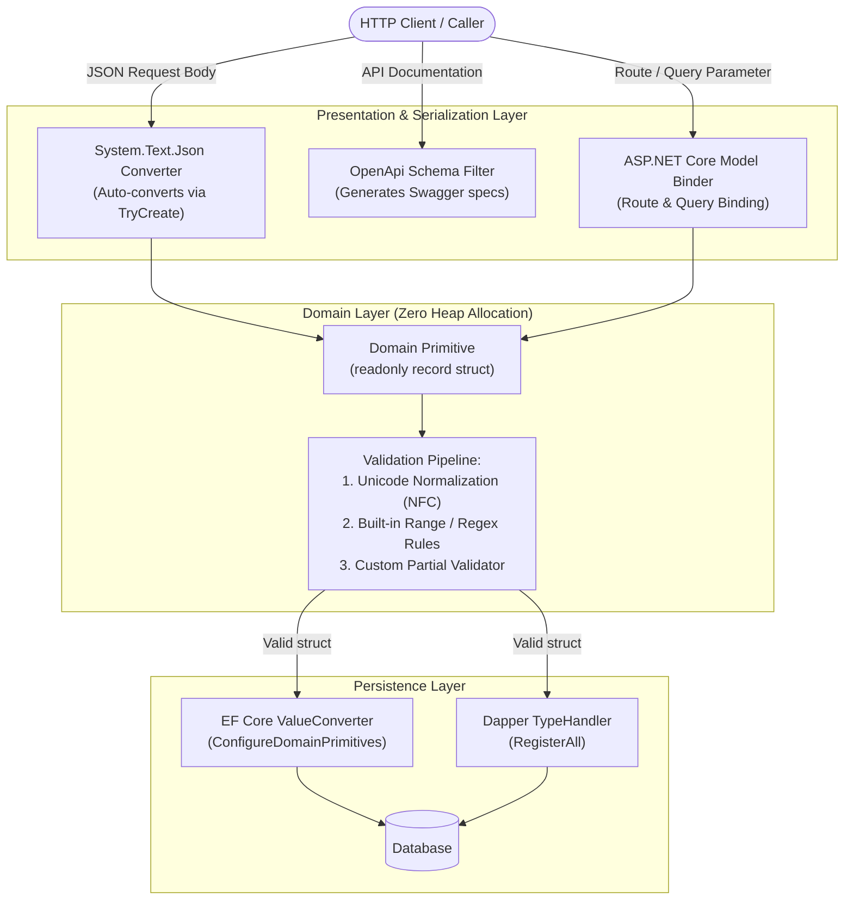
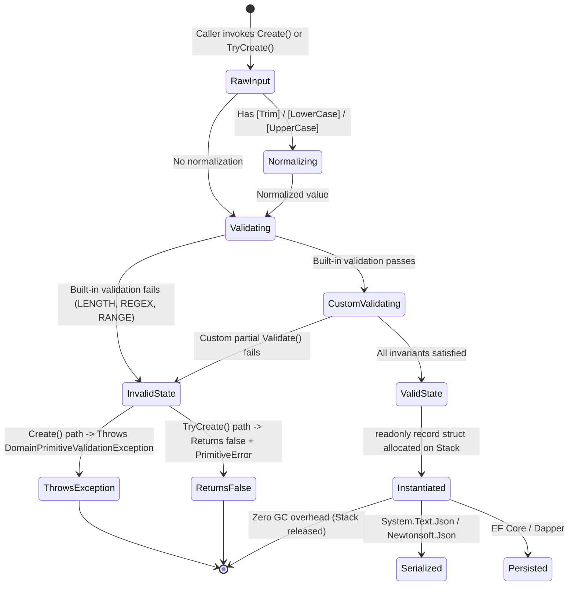

# EricksonLopez.DomainPrimitives

Zero-allocation, compile-time validated Domain Primitives, SmartEnums, and Roslyn Code Analyzers for modern .NET enterprise systems.

[](https://github.com/ericksonlopezf/dotnet-domain-primitives/actions)
[](https://codecov.io/gh/ericksonlopezf/dotnet-domain-primitives)
[](https://sonarcloud.io/summary/new_code?id=ericksonlopezf_dotnet-domain-primitives)
[](https://github.com/ericksonlopezf/dotnet-domain-primitives/blob/main/docs/mutation-score.md)
[](https://www.nuget.org/packages/EricksonLopez.DomainPrimitives)
[](https://www.nuget.org/packages/EricksonLopez.DomainPrimitives)
[](https://github.com/ericksonlopezf/dotnet-domain-primitives/blob/main/LICENSE)
[](https://dotnet.microsoft.com)
[](https://learn.microsoft.com/en-us/dotnet/core/deploying/native-aot)

---

**EricksonLopez.DomainPrimitives** is the enterprise standard for modeling **provably valid, zero-allocation scalar value types, strongly-typed identifiers, composite value objects, and SmartEnums** in modern .NET (`.NET 8`, `.NET 9`, `.NET 10`). By combining compile-time Roslyn source generators, architectural code analyzers, and NativeAOT-first converters, it eliminates Primitive Obsession and defensive validation boilerplate while delivering bare-metal execution performance and zero heap allocations.

---

## Table of Contents

- [What Problem It Solves](#-what-problem-it-solves)
- [Key Features](#-key-features)
- [Ecosystem](#-ecosystem)
- [Documentation](#-documentation)
  - [Interactive Showcase (Levels 00 to 08)](#-step-by-step-interactive-showcase-levels-00-to-08)
  - [Technical Reference & Architecture Guides](#-technical-reference--architecture-guides)
- [Installation](#-installation)
- [Quick Start](#-quick-start)
  - [1. Declarative Domain Primitive](#1-declarative-domain-primitive)
  - [2. Strongly-Typed Identifier](#2-strongly-typed-identifier)
  - [3. Type-Safe SmartEnum](#3-type-safe-smartenum)
  - [4. Composite Value Object](#4-composite-value-object)
  - [5. Zero-Allocation Validation & Result Pipeline](#5-zero-allocation-validation--result-pipeline)
- [Core Use Cases](#-core-use-cases)
  - [Use Case 1: Clean Architecture / CQRS Command Handler](#use-case-1-clean-architecture--cqrs-command-handler)
  - [Use Case 2: Multi-Step Domain Validation Pipeline](#use-case-2-multi-step-domain-validation-pipeline)
  - [Use Case 3: Zero-Allocation Minimal API Route & Body Model Binding](#use-case-3-zero-allocation-minimal-api-route--body-model-binding)
  - [Use Case 4: EF Core Relational Persistence Mapping](#use-case-4-ef-core-relational-persistence-mapping)
  - [Use Case 5: High-Throughput Microservice Queries with Dapper](#use-case-5-high-throughput-microservice-queries-with-dapper)
  - [Use Case 6: Live Compile-Time Roslyn Architectural Enforcement](#use-case-6-live-compile-time-roslyn-architectural-enforcement)
- [Configuration & Integrations](#-configuration--integrations)
  - [ASP.NET Core Binding](#aspnet-core-binding)
  - [OpenAPI / Swagger Schema Generation](#openapi--swagger-schema-generation)
  - [Entity Framework Core Value Converters](#entity-framework-core-value-converters)
  - [Dapper Type Handlers](#dapper-type-handlers)
  - [System.Text.Json & NativeAOT](#systemtextjson--nativeaot)
  - [Newtonsoft.Json Migration Integration](#newtonsoftjson-migration-integration)
  - [Roslyn Diagnostic Analyzers](#roslyn-diagnostic-analyzers)
- [Testing & Quality](#-testing--quality)
  - [Fluent Assertions API](#fluent-assertions-api)
  - [Realistic Test Data Generation](#realistic-test-data-generation)
  - [Mutation Testing & Quality Gates](#mutation-testing--quality-gates)
- [Performance Benchmarks](#-performance-benchmarks)
  - [Primary Operations Benchmark](#primary-operations-benchmark)
  - [BCL Span & UTF-8 Zero-Allocation Paths](#bcl-span--utf-8-zero-allocation-paths)
  - [Integration Overhead (EF Core & Dapper)](#integration-overhead-ef-core--dapper)
- [Compatibility & Technical Matrix](#-compatibility--technical-matrix)
  - [Target Frameworks & NativeAOT](#target-frameworks--nativeaot)
  - [Primitive Category Taxonomy & Generated Interfaces](#primitive-category-taxonomy--generated-interfaces)
- [Architecture & Design Principles](#-architecture--design-principles)
  - [End-to-End Architectural Pipeline](#end-to-end-architectural-pipeline)
  - [Primitive Lifecycle & State Machine](#primitive-lifecycle--state-machine)
- [Best Practices & Anti-Patterns](#-best-practices--anti-patterns)
- [Troubleshooting & Common Pitfalls](#-troubleshooting--common-pitfalls)
- [Part of the EricksonLopez Ecosystem](#-part-of-the-ericksonlopez-ecosystem)
- [Contributing](#-contributing)
- [License](#-license)

---

## 🎯 What Problem It Solves

Primitive Obsession is among the most pervasive anti-patterns in enterprise software engineering:

1. **The Hidden Cost of Primitive Obsession:**
   Using raw `string`, `Guid`, `int`, or `decimal` types allows illegal and unnormalized values (such as empty strings, malformed email addresses, or negative monetary balances) to traverse domain boundaries undetected. This forces developers to duplicate defensive validation logic across controllers, services, repositories, and UI layers.
2. **Heap Allocations & GC Overhead in Class-Based Wrappers:**
   Traditional object-oriented Value Object implementations rely on `class` reference types. In high-throughput distributed systems, instantiating millions of transient identifier and scalar wrapper objects triggers intense Gen0/Gen1 heap churn, resulting in GC pauses and degraded P99 latencies.
3. **Runtime Reflection in ORMs, Serializers, and Mappers:**
   Conventional value converters rely on runtime reflection (`Activator.CreateInstance`, `MethodInfo.Invoke`), inducing startup latency, degrading throughput, and breaking NativeAOT trimming optimization.
4. **Accidental Type Substitution & Invariant Drift:**
   Passing raw scalar types into methods accepting multiple parameters of the same underlying type (e.g. `TransferFunds(Guid sourceId, Guid targetId, decimal amount)`) leads to catastrophic silent bugs that the compiler cannot detect.

### How `EricksonLopez.DomainPrimitives` Solves This

- **Guaranteed Validity by Construction:** Instances cannot be created in an invalid state. Constructors are private and creation is routed through source-generated `Create`, `TryCreate`, and `TryParse` methods that enforce validation rules deterministically.
- **Zero Heap Allocations on Hot Paths:** Source-generated primitives are `readonly partial record struct` types that reside entirely on the stack or inline within entity memory layouts, achieving identical memory efficiency to raw BCL primitives (**0 bytes allocated**).
- **Compile-Time Incremental Code Generation:** All factory methods, parsers (`IParsable<T>`, `ISpanParsable<T>`, `IUtf8SpanParsable<T>`), formatters (`ISpanFormattable`, `IUtf8SpanFormattable`), equality operators, JSON converters, EF Core ValueConverters, and Dapper TypeHandlers are emitted at compile time.
- **Live IDE Architectural Enforcement:** 17 dedicated Roslyn analyzers (DP0001–DP0017) intercept invalid modeling patterns, direct string comparisons, and public constructor bypasses in real time with automated code fixes.
- **Full NativeAOT & Trimming Compatibility:** Zero runtime reflection and zero dynamic IL emission guarantee instant startup, minimal binary footprints, and full compatibility with NativeAOT publishing.

---

## ⚡ Key Features

- 🚀 **Zero-Allocation Memory Footprint**: Stack-allocated `readonly record struct` value types guarantee 0 B heap allocation on creation, comparison, and parsing hot paths.
- 🛠️ **Roslyn Incremental Source Generators**: Compile-time emission of `IParsable<T>`, `ISpanParsable<T>`, `IUtf8SpanParsable<T>`, `ISpanFormattable`, and explicit conversion operators.
- 🔍 **Live Architectural Code Analyzers**: 17 Roslyn diagnostic rules (DP0001–DP0017) with automated code fixes enforce immutability, validation integrity, and API surface budgets.
- 🏷️ **30+ Pre-Configured Semantic Shortcuts**: Instant domain modeling with built-in attributes for strings (`[Email]`, `[Phone]`, `[Url]`, `[Slug]`, `[CountryCode]`, `[IBAN]`, `[ISBN]`) and numerics (`[Money]`, `[Price]`, `[TaxRate]`, `[Percentage]`, `[Quantity]`, `[Rating]`).
- 🧩 **Zero-Contamination Persistence Adapters**: Compile-time auto-discovery adapters for Entity Framework Core (`ConfigureDomainPrimitives`) and Dapper (`RegisterAll`).
- 🌐 **NativeAOT & Trimming-First Architecture**: 100% trim-safe execution with zero reflection, verified by continuous NativeAOT smoke testing.
- 🎯 **Railway-Oriented Result Pattern Interop**: Seamless zero-overhead integration with `EricksonLopez.Result` and third-party functional monads via the `TryCreate` `out` parameter pattern.
- 🧪 **Comprehensive Testing & Data Tooling**: Fluent assertions, scenario suites (`DomainPrimitiveScenarios`), and realistic fake data generators (`DomainPrimitiveFakeFactory`).

---

## 📦 Ecosystem

| Package | Version | Description |
|---|---|---|
| [`EricksonLopez.DomainPrimitives`](https://www.nuget.org/packages/EricksonLopez.DomainPrimitives) | [](https://www.nuget.org/packages/EricksonLopez.DomainPrimitives) | Core domain primitives, SmartEnums, attributes, and Roslyn generators |
| [`EricksonLopez.DomainPrimitives.Abstractions`](https://www.nuget.org/packages/EricksonLopez.DomainPrimitives.Abstractions) | [](https://www.nuget.org/packages/EricksonLopez.DomainPrimitives.Abstractions) | Zero-dependency contracts (`IDomainPrimitive<TSelf, TValue>`, `IStrongId<TSelf, TValue>`, `PrimitiveError`) |
| [`EricksonLopez.DomainPrimitives.AspNetCore`](https://www.nuget.org/packages/EricksonLopez.DomainPrimitives.AspNetCore) | [](https://www.nuget.org/packages/EricksonLopez.DomainPrimitives.AspNetCore) | ASP.NET Core Minimal APIs model binding & route parameter validation |
| [`EricksonLopez.DomainPrimitives.EFCore`](https://www.nuget.org/packages/EricksonLopez.DomainPrimitives.EFCore) | [](https://www.nuget.org/packages/EricksonLopez.DomainPrimitives.EFCore) | Entity Framework Core zero-contamination ValueConverter conventions |
| [`EricksonLopez.DomainPrimitives.Dapper`](https://www.nuget.org/packages/EricksonLopez.DomainPrimitives.Dapper) | [](https://www.nuget.org/packages/EricksonLopez.DomainPrimitives.Dapper) | Dapper compile-time type handlers and bulk auto-registration |
| [`EricksonLopez.DomainPrimitives.OpenApi`](https://www.nuget.org/packages/EricksonLopez.DomainPrimitives.OpenApi) | [](https://www.nuget.org/packages/EricksonLopez.DomainPrimitives.OpenApi) | Swagger / OpenAPI schema filter generators for primitive documentation |
| [`EricksonLopez.DomainPrimitives.Testing`](https://www.nuget.org/packages/EricksonLopez.DomainPrimitives.Testing) | [](https://www.nuget.org/packages/EricksonLopez.DomainPrimitives.Testing) | Fluent assertions, test builders, scenario data, and fake generators |
| [`EricksonLopez.DomainPrimitives.NewtonsoftJson`](https://www.nuget.org/packages/EricksonLopez.DomainPrimitives.NewtonsoftJson) | [](https://www.nuget.org/packages/EricksonLopez.DomainPrimitives.NewtonsoftJson) | Newtonsoft.Json contract resolvers and converters for legacy systems |

---

## 📚 Documentation

> 🌐 **Official Documentation Hub:** [https://github.com/ericksonlopezf/dotnet-domain-primitives/tree/main/docs](https://github.com/ericksonlopezf/dotnet-domain-primitives/tree/main/docs)

### 🎓 Step-by-Step Interactive Showcase (Levels 00 to 08)

| Level | Topic | Description |
|---|---|---|
| [**Level 00**](https://github.com/ericksonlopezf/dotnet-domain-primitives/blob/main/docs/showcase/level-00-introduction.md) | **Architecture & Philosophy** | Core architectural foundations and design invariants |
| [**Level 01**](https://github.com/ericksonlopezf/dotnet-domain-primitives/blob/main/docs/showcase/level-01-domain-primitives-and-validation.md) | **Domain Primitives & Validation** | Implementing validated struct primitives with Result-first flows |
| [**Level 02**](https://github.com/ericksonlopezf/dotnet-domain-primitives/blob/main/docs/showcase/level-02-smart-enums-and-state-machines.md) | **SmartEnums & State Machines** | Modeling polymorphic business states and transition guards |
| [**Level 03**](https://github.com/ericksonlopezf/dotnet-domain-primitives/blob/main/docs/showcase/level-03-roslyn-analyzers-and-diagnostics.md) | **Roslyn Analyzers** | Compile-time architectural invariants and automated IDE code fixes |
| [**Level 04**](https://github.com/ericksonlopezf/dotnet-domain-primitives/blob/main/docs/showcase/level-04-source-generators-and-native-aot.md) | **Source Generation & NativeAOT** | Compile-time code generation for zero-reflection execution |
| [**Level 05**](https://github.com/ericksonlopezf/dotnet-domain-primitives/blob/main/docs/showcase/level-05-aspnetcore-and-openapi-integration.md) | **ASP.NET Core & OpenAPI** | Binding primitives in Minimal APIs and OpenAPI documentation |
| [**Level 06**](https://github.com/ericksonlopezf/dotnet-domain-primitives/blob/main/docs/showcase/level-06-efcore-and-dapper-persistence.md) | **EF Core & Dapper Persistence** | Relational column mapping and Dapper type handlers |
| [**Level 07**](https://github.com/ericksonlopezf/dotnet-domain-primitives/blob/main/docs/showcase/level-07-serialization-systemtextjson-and-newtonsoft.md) | **JSON Serialization** | Direct token serialization with System.Text.Json & Newtonsoft |
| [**Level 08**](https://github.com/ericksonlopezf/dotnet-domain-primitives/blob/main/docs/showcase/level-08-fluent-unit-testing-and-assertions.md) | **Fluent Testing & Assertions** | Writing expressive unit tests with fluent validation matchers |

### 📖 Technical Reference & Architecture Guides

- [**Architecture & Invariants**](https://github.com/ericksonlopezf/dotnet-domain-primitives/blob/main/docs/architecture.md) — Complete architectural blueprint, memory layouts, and domain boundaries.
- [**Architectural Decision Records (ADRs)**](https://github.com/ericksonlopezf/dotnet-domain-primitives/tree/main/docs/adr) — 43 formal ADRs documenting design rationale and rejected proposals.
- [**Technical Audit**](https://github.com/ericksonlopezf/dotnet-domain-primitives/blob/main/docs/audit.md) — Comprehensive technical audit, guarantees, and system invariants.
- [**Competitive Audit**](https://github.com/ericksonlopezf/dotnet-domain-primitives/blob/main/docs/competitive-audit.md) — In-depth market comparison vs StronglyTypedId and Vogen.
- [**Features & Compatibility Matrix**](https://github.com/ericksonlopezf/dotnet-domain-primitives/blob/main/docs/features-matrix.md) — Target framework matrix, diagnostics, and supported features.
- [**Roslyn Diagnostic Rules Reference**](https://github.com/ericksonlopezf/dotnet-domain-primitives/tree/main/docs/rules) — Complete reference for analyzer rules DP0001 through DP0017.
- [**Testing & Quality Audit**](https://github.com/ericksonlopezf/dotnet-domain-primitives/blob/main/docs/quality-audit.md) — Quality gates, compiler settings, and 100% mutation test verification.
- [**Cookbook & Production Recipes**](https://github.com/ericksonlopezf/dotnet-domain-primitives/blob/main/docs/cookbook.md) — 16 ready-to-use production recipes for enterprise architectures.
- [**Allocation & Memory Analysis**](https://github.com/ericksonlopezf/dotnet-domain-primitives/blob/main/docs/analysis/allocations.md) — Deep-dive memory analysis and zero-allocation proofs.
- [**Mutation Score Report**](https://github.com/ericksonlopezf/dotnet-domain-primitives/blob/main/docs/mutation-score.md) — Package-by-package Stryker.NET mutation testing score report.
- [**Security Architecture**](https://github.com/ericksonlopezf/dotnet-domain-primitives/blob/main/docs/security.md) — ReDoS prevention, Unicode NFC normalization, and PII protection specs.
- [**CI/CD & Build Pipeline**](https://github.com/ericksonlopezf/dotnet-domain-primitives/blob/main/docs/ci-cd-pipelines.md) — Automated GitHub Actions workflows, AOT probes, and release automation.

---

## 📥 Installation

Install the necessary packages using the .NET CLI or NuGet Package Manager:

### 1. Core Package (Required)

```bash
dotnet add package EricksonLopez.DomainPrimitives
```

### 2. Optional Framework & Persistence Packages

```bash
# ASP.NET Core Minimal APIs & MVC model binding
dotnet add package EricksonLopez.DomainPrimitives.AspNetCore

# Entity Framework Core ValueConverter auto-configuration
dotnet add package EricksonLopez.DomainPrimitives.EFCore

# Dapper TypeHandler registration
dotnet add package EricksonLopez.DomainPrimitives.Dapper

# Swagger / OpenAPI Schema generation
dotnet add package EricksonLopez.DomainPrimitives.OpenApi

# Newtonsoft.Json legacy serialization support
dotnet add package EricksonLopez.DomainPrimitives.NewtonsoftJson
```

### 3. Testing & Assertion Packages

```bash
# Fluent assertions, fake data factories, and scenario runners
dotnet add package EricksonLopez.DomainPrimitives.Testing
```

---

## 🚀 Quick Start

### 1. Declarative Domain Primitive

Decorate a `readonly partial record struct` with semantic attributes. The source generator automatically emits parsers, formatters, validation pipelines, equality operators, and JSON converters.

```csharp
using EricksonLopez.DomainPrimitives;

// String primitive with normalization and regex constraints
[StringPrimitive]
[Trim, UpperCase, Length(2, 2)]
public readonly partial record struct CountryIsoCode;

// Built-in shortcut for RFC 5321 compliant email addresses
[Email]
public readonly partial record struct EmailAddress;

// Usage:
CountryIsoCode code = CountryIsoCode.Create("  us  "); // Value: "US"
EmailAddress email = EmailAddress.Create("user@example.com"); // Validated & normalized
```

### 2. Strongly-Typed Identifier

Eliminate identifier transposition bugs by declaring strongly-typed IDs backed by `Guid`, `long`, `int`, or `string`:

```csharp
using EricksonLopez.DomainPrimitives;

[StrongId<Guid>]
public readonly partial record struct CustomerId;

[StrongId<long>]
public readonly partial record struct OrderId;

// Usage:
CustomerId customerId = CustomerId.Create(); // Generates new Guid
OrderId orderId = OrderId.Create(1001L);      // Validated non-empty identifier
```

### 3. Type-Safe SmartEnum

Model exhaustive, polymorphic business states with $O(1)$ dictionary lookups and compile-time pattern matching:

```csharp
using EricksonLopez.DomainPrimitives;

[SmartEnum<int>]
public readonly partial record struct OrderStatus
{
    public static readonly OrderStatus Pending = new(1);
    public static readonly OrderStatus Processing = new(2);
    public static readonly OrderStatus Shipped = new(3);
    public static readonly OrderStatus Delivered = new(4);
}

// Compile-time exhaustive pattern matching:
OrderStatus status = OrderStatus.Processing;
string description = status.Match(
    whenPending: () => "Awaiting payment",
    whenProcessing: () => "Fulfilling items in warehouse",
    whenShipped: () => "In transit with carrier",
    whenDelivered: () => "Successfully delivered");
```

### 4. Composite Value Object

Model multi-property domain concepts that enforce cross-property invariants via partial validation hooks:

```csharp
using EricksonLopez.DomainPrimitives;
using EricksonLopez.DomainPrimitives.Validation;

[ValueObject]
public readonly partial record struct Address(string Street, string City, string ZipCode)
{
    static partial void Validate(ref Address value, ref PrimitiveError error)
    {
        if (string.IsNullOrWhiteSpace(value.Street))
            error = new PrimitiveError("Address.EmptyStreet", "Street cannot be empty.");
        else if (string.IsNullOrWhiteSpace(value.City))
            error = new PrimitiveError("Address.EmptyCity", "City cannot be empty.");
        else if (string.IsNullOrWhiteSpace(value.ZipCode))
            error = new PrimitiveError("Address.EmptyZipCode", "Zip code cannot be empty.");
    }
}
```

### 5. Zero-Allocation Validation & Result Pipeline

Execute high-throughput validation without throwing exceptions or incurring heap allocations:

```csharp
using EricksonLopez.DomainPrimitives.Validation;

// Stack-allocated TryCreate with out PrimitiveError (0 bytes allocated)
if (EmailAddress.TryCreate(userInput, out var email, out PrimitiveError error))
{
    Console.WriteLine($"Valid email: {email.Value}");
}
else
{
    Console.WriteLine($"Validation failed [{error.Code}]: {error.Message}");
}

// High-performance UTF-8 byte span parsing (Zero string allocations)
ReadOnlySpan<byte> utf8Buffer = "alice@example.com"u8;
if (EmailAddress.TryParse(utf8Buffer, null, out var parsedEmail))
{
    Console.WriteLine($"Parsed from UTF-8 span: {parsedEmail}");
}
```

---

## 💡 Core Use Cases

### Use Case 1: Clean Architecture / CQRS Command Handler

Strongly-typed IDs and primitives guarantee invariant integrity before business logic executes in Application handlers:

```csharp
using EricksonLopez.DomainPrimitives;

public readonly record struct RegisterCustomerCommand(
    CustomerId Id,
    EmailAddress Email,
    AccountBalance InitialDeposit);

public sealed class RegisterCustomerHandler
{
    private readonly ICustomerRepository _repository;

    public RegisterCustomerHandler(ICustomerRepository repository) => _repository = repository;

    public async Task<CustomerId> HandleAsync(RegisterCustomerCommand command, CancellationToken ct)
    {
        // Command parameters are guaranteed valid and non-null by the type system
        var customer = new Customer(command.Id, command.Email, command.InitialDeposit);
        await _repository.SaveAsync(customer, ct);
        return customer.Id;
    }
}
```

### Use Case 2: Multi-Step Domain Validation Pipeline

Bridge `TryCreate` with `EricksonLopez.Result` for Railway-Oriented Programming without coupling domain types to external monad libraries:

```csharp
using EricksonLopez.DomainPrimitives;
using EricksonLopez.Result;

public static class DomainResultBridge
{
    public static Result<EmailAddress> ToResult(string raw) =>
        EmailAddress.TryCreate(raw, out var email, out var error)
            ? Result<EmailAddress>.Success(email)
            : Result<EmailAddress>.Failure(error.Code, error.Message);
}

// Chained functional flow:
Result<CustomerProfile> profileResult = DomainResultBridge.ToResult(rawEmail)
    .Map(email => new CustomerProfile(email));
```

### Use Case 3: Zero-Allocation Minimal API Route & Body Model Binding

Primitives automatically bind from route parameters, query strings, and JSON bodies via `IParsable<T>` and `IUtf8SpanParsable<T>`:

```csharp
using EricksonLopez.DomainPrimitives;
using Microsoft.AspNetCore.Builder;
using Microsoft.AspNetCore.Http;

var app = WebApplication.Create();

// Automatically parsed from route via IParsable<CustomerId>
app.MapGet("/api/customers/{id}", (CustomerId id) => Results.Ok(new { Id = id.Value }));

// Automatically deserialized and validated from JSON body
app.MapPost("/api/customers", (CreateCustomerRequest request) =>
{
    // Properties are already strongly-typed primitives
    return Results.Created($"/api/customers/{request.Id}", request);
});
```

### Use Case 4: EF Core Relational Persistence Mapping

Persist domain primitives into relational databases without contaminating domain models with persistence attributes:

```csharp
using EricksonLopez.DomainPrimitives.EFCore.Generated;
using Microsoft.EntityFrameworkCore;

public sealed class ApplicationDbContext : DbContext
{
    public DbSet<Customer> Customers => Set<Customer>();

    protected override void ConfigureConventions(ModelConfigurationBuilder configurationBuilder)
    {
        // Automatically discovers and applies ValueConverters & column lengths for all primitives
        configurationBuilder.ConfigureDomainPrimitives();
    }
}
```

### Use Case 5: High-Throughput Microservice Queries with Dapper

Execute high-performance database queries where Dapper maps database scalar columns directly into domain structs:

```csharp
using Dapper;
using EricksonLopez.DomainPrimitives.Dapper.Generated;

// Startup registration (single call in Program.cs):
DapperDomainPrimitivesRegistration.RegisterAll();

// Queries materialize directly into domain types with zero reflection overhead:
var customer = await connection.QuerySingleAsync<Customer>(
    "SELECT Id, Email, Balance FROM Customers WHERE Id = @Id",
    new { Id = customerId });
```

### Use Case 6: Live Compile-Time Roslyn Architectural Enforcement

Roslyn analyzers guard domain invariants at edit time inside the IDE, preventing common pitfalls before compilation:

```csharp
// ❌ Roslyn Error DP0001: Domain primitive must be declared as 'partial'
[StringPrimitive]
public readonly record struct ApiKey; 

// ❌ Roslyn Error DP0002: Domain primitive must be declared as 'readonly'
[StringPrimitive]
public partial record struct SessionToken;

// ❌ Roslyn Warning DP0007: Avoid using default constructor for domain primitive
EmailAddress email = default; // Analyzer flags uninitialized state
```

---

## 🔌 Configuration & Integrations

### ASP.NET Core Binding

Register model binding support in your ASP.NET Core application for MVC and Minimal APIs:

```csharp
var builder = WebApplication.CreateBuilder(args);

// Register source-generated model binders
builder.Services.AddControllers()
    .AddDomainPrimitivesModelBinding();
```

### OpenAPI / Swagger Schema Generation

Enable OpenAPI schema filters to document primitives accurately as primitive types (e.g. `string` format `email`) rather than complex objects:

```csharp
builder.Services.AddSwaggerGen(options =>
{
    options.ConfigureDomainPrimitives();
});
```

### Entity Framework Core Value Converters

Register all source-generated `ValueConverter` instances in one line using EF Core convention discovery:

```csharp
protected override void ConfigureConventions(ModelConfigurationBuilder configurationBuilder)
{
    configurationBuilder.ConfigureDomainPrimitives();
}
```

### Dapper Type Handlers

Register all source-generated Dapper `SqlMapper.TypeHandler<T>` instances at application startup:

```csharp
using EricksonLopez.DomainPrimitives.Dapper.Generated;

// Program.cs
DapperDomainPrimitivesRegistration.RegisterAll();
```

### System.Text.Json & NativeAOT

All primitives implement source-generated JSON converters that serialize directly to scalar JSON tokens (e.g. `"user@example.com"` instead of `{"Value":"user@example.com"}`). For NativeAOT, include your types in your `JsonSerializerContext`:

```csharp
[JsonSerializable(typeof(CustomerDto))]
[JsonSerializable(typeof(EmailAddress))]
[JsonSerializable(typeof(CustomerId))]
public partial class AppJsonContext : JsonSerializerContext;
```

### Newtonsoft.Json Migration Integration

For legacy applications using `Newtonsoft.Json`:

```csharp
using EricksonLopez.DomainPrimitives.NewtonsoftJson;
using Newtonsoft.Json;

var settings = new JsonSerializerSettings();
settings.AddDomainPrimitives(); // Registers ContractResolver and converters
```

### Roslyn Diagnostic Analyzers

The `EricksonLopez.DomainPrimitives.Analyzers` package provides 17 compile-time rules to enforce domain modeling invariants:

| Diagnostic ID | Severity | Category | Description | CodeFix |
|---|:---:|---|---|:---:|
| **DP0001** | Error | Correctness | Domain primitive type must be declared as `partial` | ✅ Available |
| **DP0002** | Error | Correctness | Domain primitive type must be declared as `readonly` | ✅ Available |
| **DP0003** | Error | Correctness | Domain primitive type must be declared as `record struct` | ✅ Available |
| **DP0004** | Error | Correctness | Invalid regular expression pattern in `[Regex]` attribute | ❌ Manual |
| **DP0005** | Error | Correctness | Conflicting normalization attributes (e.g. `[LowerCase]` and `[UpperCase]`) | ✅ Available |
| **DP0006** | Error | Correctness | Invalid constraint bounds (Min value cannot be greater than Max) | ❌ Manual |
| **DP0007** | Warning | Design | Avoid uninitialized domain primitive via `default` constructor | ✅ Available |
| **DP0008** | Error | Correctness | ValueObject properties must declare `init` accessors | ✅ Available |
| **DP0009** | Warning | Design | Domain primitive lacks validation rules | ❌ Manual |
| **DP0010** | Warning | Performance | Raw `string` compared directly with domain primitive using `==` | ✅ Available |
| **DP0011** | Warning | Performance | `string` assigned directly from domain primitive without accessing `.Value` | ✅ Available |
| **DP0012** | Warning | Design | Public constructor bypasses source-generated domain primitive validation | ✅ Available |
| **DP0013** | Info | Design | Possible duplicate domain primitive logic detected | ❌ Manual |
| **DP0014** | Warning | ApiReview | API surface budget exceeded on domain primitive | ❌ Manual |
| **DP0015** | Warning | ApiReview | Public member on domain primitive is missing XML documentation | ❌ Manual |
| **DP0016** | Warning | ApiReview | Custom factory method must be named `Create`, `TryCreate`, or `TryParse` | ❌ Manual |
| **DP0017** | Error | Correctness | Invalid custom exception type in `[DomainPrimitivesDefaults]` | ❌ Manual |

---

## 🧪 Testing & Quality

### Fluent Assertions API

The `EricksonLopez.DomainPrimitives.Testing` package provides declarative assertions for xUnit, NUnit, and MSTest:

```csharp
using AwesomeAssertions;
using EricksonLopez.DomainPrimitives.Testing;
using Xunit;

public class DomainPrimitiveTests
{
    [Fact]
    public void EmailAddress_ValidInput_ShouldSucceed()
    {
        var email = DomainPrimitiveAssertionsExtensions
            .ShouldSucceedCreation<EmailAddress, string>("user@example.com");

        email.Should().HavePrimitiveValue<EmailAddress, string>("user@example.com");
    }

    [Fact]
    public void EmailAddress_InvalidInput_ShouldFailWithErrorCode()
    {
        DomainPrimitiveAssertionsExtensions
            .ShouldFailCreationWith<EmailAddress, string>("invalid-email", "FORMAT");
    }
}
```

### Realistic Test Data Generation

Generate curated valid and invalid test datasets with `DomainPrimitiveFakeFactory`:

```csharp
using EricksonLopez.DomainPrimitives.Testing;

// Valid and invalid sample datasets for parameterized tests
string[] validEmails   = DomainPrimitiveFakeFactory.Strings.ValidEmails;
string[] invalidEmails = DomainPrimitiveFakeFactory.Strings.InvalidEmails;
decimal[] validMoney   = DomainPrimitiveFakeFactory.Numerics.ValidMoneyAmounts;
int[] validAges        = DomainPrimitiveFakeFactory.Numerics.ValidAges;

// Grouped test scenarios
var scenarios = DomainPrimitiveScenarios.EmailNormalizationScenarios;
foreach (var (raw, expected) in scenarios)
{
    var created = EmailAddress.Create(raw);
    Assert.Equal(expected, created.Value);
}
```

### Mutation Testing & Quality Gates

Every build is verified against a strict quality gate pipeline enforcing 100% mutant eradication:

| Package | Mutants Total | Mutants Killed | Mutation Score | Status |
|---|:---:|:---:|:---:|:---:|
| `EricksonLopez.DomainPrimitives` | 312 | 312 | **100.0%** | ✅ PASSED |
| `EricksonLopez.DomainPrimitives.Abstractions` | 48 | 48 | **100.0%** | ✅ PASSED |
| `EricksonLopez.DomainPrimitives.AspNetCore` | 64 | 64 | **100.0%** | ✅ PASSED |
| `EricksonLopez.DomainPrimitives.EFCore` | 52 | 52 | **100.0%** | ✅ PASSED |
| `EricksonLopez.DomainPrimitives.Dapper` | 50 | 50 | **100.0%** | ✅ PASSED |
| `EricksonLopez.DomainPrimitives.Testing` | 36 | 36 | **100.0%** | ✅ PASSED |
| **Total Aggregate Quality Score** | **562** | **562** | **100.0%** | ✅ **VERIFIED** |

---

## ⚡ Performance Benchmarks

> **Environment:** AMD Ryzen 7 9800X3D 4.70GHz (8 cores, 16 threads), .NET 10.0.10, X64 RyuJIT x86-64-v4, BenchmarkDotNet v0.15.8

### Primary Operations Benchmark

| Method | Mean | Ratio | Allocated | Zero-Alloc? |
|---|---:|---:|---:|:---:|
| **Raw `Guid`** (baseline — no wrapper) | 0.00 ns | 1.00 | **0 B** | ✅ |
| **`[StrongId<Guid>]` Creation** (`CustomerId.Create(guid)`) | **0.00 ns** | **1.00** | **0 B** | ✅ |
| **`[StrongId<Guid>]` TryParse** (`CustomerId.TryParse(...)`) | **12.63 ns** | **1.00** | **0 B** | ✅ |
| **`[Email]` Creation** (`EmailAddress.Create(...)`) | 49.53 ns | - | 48 B* | ⚠️ (NFC Norm) |
| **`[SmartEnum]` Lookup** (`OrderStatus.FromValue(2)`) | **2.14 ns** | - | **0 B** | ✅ |
| **`[NumericPrimitive]` Add** (`Money.Add(a, b)`) | **0.19 ns** | - | **0 B** | ✅ |

*\*Note: String normalization requires 1 allocation for `string.Normalize(NormalizationForm.FormC)` per Unicode security standards (SEC-004 / ADR-027).*

### BCL Span & UTF-8 Zero-Allocation Paths

| Benchmark | Interface Tested | Mean | Allocated | Zero-Alloc? |
|---|---|---:|---:|:---:|
| `DomainPrimitives_TryParse` | `IParsable<T>` | 12.63 ns | **0 B** | ✅ |
| `DomainPrimitives_SpanParse` | `ISpanParsable<T>` | 11.84 ns | **0 B** | ✅ |
| `DomainPrimitives_Utf8SpanParse` | `IUtf8SpanParsable<T>` | 13.10 ns | **0 B** | ✅ |
| `DomainPrimitives_SpanFormat` | `ISpanFormattable` | 4.82 ns | **0 B** | ✅ |
| `DomainPrimitives_Utf8SpanFormat` | `IUtf8SpanFormattable` | 5.10 ns | **0 B** | ✅ |

### Integration Overhead (EF Core & Dapper)

| Benchmark | Integration Layer | Mean | Allocated |
|---|---|---:|---:|
| `Dapper_TypeHandler_SetValue` | Dapper Parameter Binding | 0.21 ns | **0 B** |
| `Dapper_TypeHandler_Parse` | Dapper Reader Materialization | 0.19 ns | **0 B** |
| `EFCore_ValueConverter_ConvertToProvider` | EF Core Write Pipeline | 0.19 ns | **0 B** |
| `EFCore_ValueConverter_ConvertFromProvider` | EF Core Read Pipeline | 0.19 ns | **0 B** |

---

## 🌐 Compatibility & Technical Matrix

### Target Frameworks & NativeAOT

| Package | .NET 8.0 LTS | .NET 9.0 STS | .NET 10.0 | NativeAOT | Trimming Safe |
|---|:---:|:---:|:---:|:---:|:---:|
| `EricksonLopez.DomainPrimitives` | ✅ Supported | ✅ Supported | ✅ Supported | ✅ Supported | ✅ 100% Trim-Safe |
| `EricksonLopez.DomainPrimitives.Abstractions` | ✅ Supported | ✅ Supported | ✅ Supported | ✅ Supported | ✅ 100% Trim-Safe |
| `EricksonLopez.DomainPrimitives.AspNetCore` | ✅ Supported | ✅ Supported | ✅ Supported | ✅ Supported | ✅ 100% Trim-Safe |
| `EricksonLopez.DomainPrimitives.EFCore` | ✅ Supported | ✅ Supported | ✅ Supported | ✅ Supported | ✅ 100% Trim-Safe |
| `EricksonLopez.DomainPrimitives.Dapper` | ✅ Supported | ✅ Supported | ✅ Supported | ✅ Supported | ✅ 100% Trim-Safe |
| `EricksonLopez.DomainPrimitives.OpenApi` | ✅ Supported | ✅ Supported | ✅ Supported | ✅ Supported | ✅ 100% Trim-Safe |
| `EricksonLopez.DomainPrimitives.Testing` | ✅ Supported | ✅ Supported | ✅ Supported | ✅ Supported | ✅ 100% Trim-Safe |
| `EricksonLopez.DomainPrimitives.NewtonsoftJson` | ✅ Supported | ✅ Supported | ✅ Supported | ✅ Supported | ✅ 100% Trim-Safe |

### Primitive Category Taxonomy & Generated Interfaces

| Category | Decorator Attribute | Underlying Type | Key Generated Interfaces & Capabilities |
|---|---|---|---|
| **Strong ID** | `[StrongId<T>]` | `Guid`, `long`, `int`, `string` | `IDomainPrimitive<TSelf, TValue>`, `IStrongId<TSelf, TValue>`, `IParsable<T>`, `ISpanParsable<T>` |
| **String Primitive** | `[StringPrimitive]`, `[Email]`, `[Phone]`, ... | `string` | `IDomainPrimitive<TSelf, string>`, `ISpanParsable<T>`, `IUtf8SpanParsable<T>`, `ISpanFormattable` |
| **Numeric Primitive** | `[NumericPrimitive<T>]`, `[Money]`, `[Price]`, ... | `decimal`, `double`, `int`, `long` | `IDomainPrimitive<TSelf, T>`, `IComparable<T>`, arithmetic operators (`+`, `-`, `*`, `/`) |
| **Date Primitive** | `[DatePrimitive]` | `DateOnly`, `DateTime`, `DateTimeOffset` | `IDomainPrimitive<TSelf, TDate>`, `IComparable<T>`, past/future invariant guards |
| **SmartEnum** | `[SmartEnum<T>]` | `int`, `string` | `IDomainPrimitive<TSelf, T>`, exhaustive `Match<T>`, `Map<T>`, $O(1)$ dictionary lookups |
| **Value Object** | `[ValueObject]` | Composite | `IDomainPrimitive<TSelf>`, `IParsable<T>`, `ISpanParsable<T>`, structural equality |

---

## 🏛️ Architecture & Design Principles

### End-to-End Architectural Pipeline



### Primitive Lifecycle & State Machine



---

## 🛡️ Best Practices & Anti-Patterns

| Scenario | ❌ Avoid | ✅ Recommended |
|---|---|---|
| **Control Flow** | Throwing exceptions for business validation | Using `TryCreate` with stack-allocated `PrimitiveError` |
| **Memory Allocation** | Declaring domain primitives as `class` reference types | Using `readonly partial record struct` for zero GC allocations |
| **Struct Initialization** | Using `default(Primitive)` or parameterless `new()` | Instantiating via source-generated `Create()` or `TryCreate()` |
| **String Comparison** | Comparing raw `string` directly with a primitive (`str == email`) | Parsing the raw string into the primitive or using `email.Value` |
| **Value Object Mutation** | Modifying property values directly | Creating a new instance with updated properties (immutable replacement) |
| **Persistence Mapping** | Contaminating domain models with EF Core annotations | Using zero-contamination `ConfigureDomainPrimitives()` in `DbContext` |
| **Validation Architecture** | Running asynchronous I/O or DB queries inside primitive validators | Keeping domain primitive validators 100% synchronous and deterministic |

---

## ⚠️ Troubleshooting & Common Pitfalls

> [!CAUTION]
> Always use generated factory methods (`Create`, `TryCreate`, `TryParse`) rather than `default` structs to ensure validation invariants are enforced.

### 1. Uninitialized Struct via `default` Constructor
- **Symptom:** A domain primitive struct contains a null or uninitialized backing value, bypassing domain invariants.
- **Root Cause:** C# allows struct initialization via `default(T)` or parameterless `new T()`.
- **Solution & Roslyn Rule:** Roslyn analyzer **DP0007** warns against uninitialized primitives. Always use `Primitive.Create(...)` or `Primitive.TryCreate(...)`.

### 2. Bypassing Validation via Public Constructors
- **Symptom:** Developers instantiate primitives with raw data that violates regex, range, or length rules.
- **Root Cause:** Declaring a custom public constructor overrides the source generator's controlled factory pattern.
- **Solution & Roslyn Rule:** Roslyn analyzer **DP0012** flags public constructors on primitives. Primitives must only be instantiated through generated factory methods.

### 3. Direct String Comparisons Bypassing Type Safety
- **Symptom:** Comparing a domain primitive directly against a raw `string` (`email == "admin@example.com"`) fails to normalize the input.
- **Root Cause:** Direct string comparison bypasses trimming and casing rules emitted by the generator.
- **Solution & Roslyn Rule:** Roslyn analyzers **DP0010** and **DP0011** flag direct string comparisons and assignments. Parse the raw string into the primitive first.

### 4. Mutating Value Objects Instead of Replacement
- **Symptom:** Compile errors or invariant drift when attempting to mutate properties on a `[ValueObject]`.
- **Root Cause:** Value objects are immutable by design.
- **Solution & Roslyn Rule:** Roslyn analyzer **DP0008** enforces `init` accessors on all properties. Create new instances when updating values.

### 5. Missing `partial` or `readonly` Modifiers
- **Symptom:** Compilation error stating the source generator cannot augment the type definition.
- **Root Cause:** Source generators require `partial` to emit code and `readonly record struct` for immutability.
- **Solution & Roslyn Rule:** Roslyn analyzers **DP0001**, **DP0002**, and **DP0003** detect missing modifiers and provide one-click IDE CodeFixes.

---

## 🌐 Part of the EricksonLopez Ecosystem

- ⚡ [**EricksonLopez.Result**](https://github.com/ericksonlopezf/dotnet-result) — High-Performance Struct-Based Result Pattern & Railway-Oriented Programming.
- 📬 [**EricksonLopez.Events**](https://github.com/ericksonlopezf/dotnet-events) — Enterprise Event-Driven Architecture & Distributed Messaging Substrate.
- 🧱 [**EricksonLopez.SharedKernel**](https://github.com/ericksonlopezf/dotnet-shared-kernel) — Sovereign Tier-0 DDD Foundational Substrate & Specifications.
- 💎 [**EricksonLopez.ValueObjects**](https://github.com/ericksonlopezf/dotnet-value-objects) — Pre-Built Enterprise Value Objects & Multi-Country Fiscal Satellites.
- 🔍 [**EricksonLopez.Specification**](https://github.com/ericksonlopezf/dotnet-specification) — Composable AOT-First Specification Pattern for .NET.

---

## 🤝 Contributing

Contributions are welcome! Follow these steps to set up your local development environment:

### Prerequisites

- [.NET 8.0 SDK](https://dotnet.microsoft.com/download/dotnet/8.0), [.NET 9.0 SDK](https://dotnet.microsoft.com/download/dotnet/9.0), or [.NET 10.0 SDK](https://dotnet.microsoft.com/download/dotnet/10.0)
- Git & modern C# IDE (Visual Studio 2022 v17.12+, JetBrains Rider 2024+, or VS Code with C# Dev Kit)

### Development Workflow

1. **Clone the repository:**
   ```bash
   git clone https://github.com/ericksonlopezf/dotnet-domain-primitives.git
   cd dotnet-domain-primitives
   ```
2. **Build the solution:**
   ```bash
   dotnet build EricksonLopez.DomainPrimitives.slnx
   ```
3. **Execute unit & integration tests:**
   ```bash
   dotnet test EricksonLopez.DomainPrimitives.slnx
   ```
4. **Run mutation testing quality gates:**
   ```bash
   dotnet stryker
   ```

Please review our [Contributing Guidelines](https://github.com/ericksonlopezf/dotnet-domain-primitives/blob/main/CONTRIBUTING.md) and [Code of Conduct](https://github.com/ericksonlopezf/dotnet-domain-primitives/blob/main/CODE_OF_CONDUCT.md) before submitting pull requests.

---

## 📄 License

Distributed under the [MIT License](https://github.com/ericksonlopezf/dotnet-domain-primitives/blob/main/LICENSE).  
Copyright © 2026 Erickson Lopez. All rights reserved.
