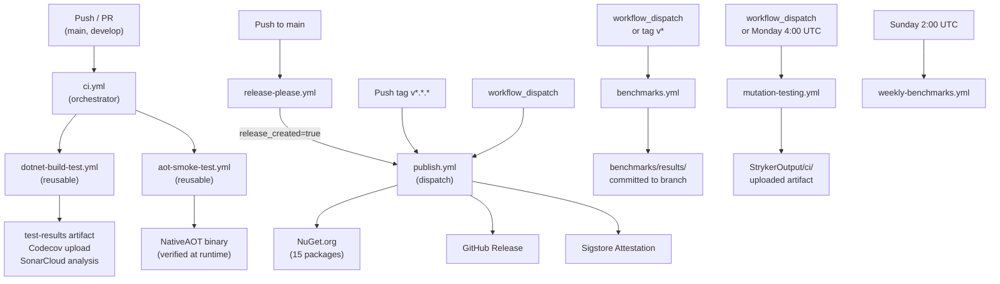

# CI/CD Pipelines and Quality Gates

This document describes the Continuous Integration and Continuous Delivery infrastructure for `EricksonLopez.DomainPrimitives`. All workflow definitions live in [`.github/workflows/`](../.github/workflows/).

---

## Workflow Architecture

The pipeline follows a **reusable-workflow pattern**: the entry-point orchestrators (`ci.yml`, `release-please.yml`) delegate actual work to reusable workflows. This eliminates duplication across push, PR, publish, and benchmark triggers.

---

## Workflow Reference

### `ci.yml` — Main CI Orchestrator

| Property | Value |
|----------|-------|
| **File** | [`.github/workflows/ci.yml`](../.github/workflows/ci.yml) |
| **Trigger** | `push` to `main`, `develop`; `pull_request` targeting `main`, `develop` |
| **Runner** | Delegates to reusable workflows |

This is a thin orchestrator. It calls two reusable workflows in parallel and passes secrets through:

| Job | Calls | Secrets forwarded |
|-----|-------|-------------------|
| `build-and-test` | `dotnet-build-test.yml` | `SNK_KEY`, `CODECOV_TOKEN`, `SONAR_TOKEN` |
| `aot-smoke-test` | `aot-smoke-test.yml` | `SNK_KEY` |

---

### `dotnet-build-test.yml` — Reusable Build & Test

| Property | Value |
|----------|-------|
| **File** | [`.github/workflows/dotnet-build-test.yml`](../.github/workflows/dotnet-build-test.yml) |
| **Trigger** | `workflow_call` only (called by `ci.yml`) |
| **Runner** | `ubuntu-latest` |

#### Inputs

| Input | Type | Default | Description |
|-------|------|---------|-------------|
| `dotnet-version` | `string` | `10.0.x` | .NET SDK version to install |
| `test-filter` | `string` | `""` | dotnet test `--filter` expression |
| `test-project` | `string` | `""` | Specific test project path (empty = all) |
| `upload-coverage` | `boolean` | `true` | Upload coverage to Codecov |
| `artifact-name` | `string` | `test-results` | Name for the uploaded test results artifact |

#### Secrets

| Secret | Required | Purpose |
|--------|----------|---------|
| `SNK_KEY` | Optional | Base64-encoded `.snk` for strong-name signing |
| `CODECOV_TOKEN` | Optional | Codecov upload token |
| `SONAR_TOKEN` | Optional | SonarCloud token |

#### Steps

| # | Step | Purpose |
|---|------|---------|
| 1 | Checkout | `actions/checkout@v4` |
| 2 | Setup .NET | `actions/setup-dotnet@v4` — version from input |
| 3 | Restore Strong Name key | Decodes `SNK_KEY` secret → `EricksonLopez.snk` |
| 4 | Restore | `dotnet restore EricksonLopez.DomainPrimitives.slnx` |
| 5 | Setup Java 17 | Required for SonarScanner (Zulu distribution) |
| 6 | Install SonarScanner | `dotnet tool install --global dotnet-sonarscanner` |
| 7 | Begin Sonar Analysis | `dotnet sonarscanner begin` (guarded: skipped if `SONAR_TOKEN` is empty) |
| 8 | **Build (Release)** | `dotnet build --no-restore --configuration Release` |
| 9 | **API Compatibility Check** | `dotnet pack -p:PackageValidationBaselineVersion=1.1.0` — detects binary-breaking changes (P1 Gate) |
| 10 | **API Surface Budget Gate** | `dotnet test --filter "Category=ApiSurfaceBudget"` — enforces member count budgets (P2 Gate) |
| 11 | **Run Tests** | `dotnet test --no-build --configuration Release --collect:"XPlat Code Coverage"` — opencover + cobertura formats |
| 12 | End Sonar Analysis | `dotnet sonarscanner end` (guarded: skipped if `SONAR_TOKEN` is empty) |
| 13 | Upload test results | `actions/upload-artifact@v4` → `{artifact-name}` |
| 14 | Upload coverage to Codecov | `codecov/codecov-action@v4` with `fail_ci_if_error: false` |

#### Artifacts Produced

| Artifact | Path | Retention |
|----------|------|-----------|
| Test results | `./test-results/` | Default (90 days) |
| Coverage (opencover) | `**/coverage.opencover.xml` | Uploaded to Codecov |
| Coverage (cobertura) | `**/coverage.cobertura.xml` | Uploaded to Codecov |

---

### `aot-smoke-test.yml` — NativeAOT Smoke Test

| Property | Value |
|----------|-------|
| **File** | [`.github/workflows/aot-smoke-test.yml`](../.github/workflows/aot-smoke-test.yml) |
| **Trigger** | `workflow_call`; `push`/`pull_request` to `main`, `develop`; `workflow_dispatch` |
| **Runner** | `ubuntu-latest` |
| **Timeout** | 20 minutes |

Installs NativeAOT prerequisites (`clang`, `lld`, `zlib1g-dev`), builds the solution, publishes the `AotProbe` project (`-p:PublishAot=true --runtime linux-x64 --self-contained`), and executes the resulting native binary to verify zero-allocation correctness at runtime.

| Secret | Required |
|--------|----------|
| `SNK_KEY` | Optional |

On failure, the AOT output directory is uploaded as a diagnostic artifact (7-day retention).

---

### `publish.yml` — Pack & Publish to NuGet

| Property | Value |
|----------|-------|
| **File** | [`.github/workflows/publish.yml`](../.github/workflows/publish.yml) |
| **Trigger** | `push` of tags matching `v*.*.*`; `workflow_dispatch` with optional `version` input |
| **Runner** | `ubuntu-latest` |
| **Permissions** | `id-token: write`, `contents: write`, `attestations: write` |

#### Version Resolution (in order of precedence)

1. `workflow_dispatch` input `version` (if provided)
2. Git tag name (strip `v` prefix) if triggered by a tag push
3. `VersionPrefix` parsed from `Directory.Build.props` (fallback)

#### Steps

| # | Step | Purpose |
|---|------|---------|
| 1 | Checkout (full history) | `fetch-depth: 0` for tag access |
| 2 | Resolve version | Sets `VERSION` output from tag / input / props |
| 3 | Setup .NET | `10.0.x` |
| 4 | Restore Strong Name key | Decodes `SNK_KEY` → `EricksonLopez.snk` |
| 5 | Restore | `dotnet restore` |
| 6 | Build (Release) | `dotnet build --configuration Release` |
| 7 | **Run tests** | Full test suite before any packing |
| 8 | Upload coverage to Codecov | Publish-gate coverage snapshot |
| 9 | **Pack All 15 Packages** | `dotnet pack` with `VersionPrefix=$VERSION` for each package |
| 10 | **Sigstore Attestation** | `actions/attest-build-provenance@v2` — attestation for all `.nupkg` files |
| 11 | NuGet login (OIDC) | `NuGet/login@v1` — no static API key |
| 12 | Push to NuGet.org | `dotnet nuget push --skip-duplicate` |
| 13 | Create GitHub Release | `softprops/action-gh-release@v2` (tag-triggered only); `prerelease=true` if version contains `-` |

#### Secrets

| Secret | Required | Purpose |
|--------|----------|---------|
| `SNK_KEY` | Optional | Strong-name signing |
| `CODECOV_TOKEN` | Optional | Coverage upload |
| `GITHUB_TOKEN` | Auto | Release creation |

---

### `release-please.yml` — Automated Release Management

| Property | Value |
|----------|-------|
| **File** | [`.github/workflows/release-please.yml`](../.github/workflows/release-please.yml) |
| **Trigger** | `push` to `main` |
| **Permissions** | `contents: write`, `pull-requests: write` |

Uses [`googleapis/release-please-action@v4`](https://github.com/googleapis/release-please-action) with config from [`.release-please-config.json`](../.release-please-config.json) and manifest from [`.release-please-manifest.json`](../.release-please-manifest.json).

When a release is created (`release_created=true`), a `trigger-publish` job dispatches `publish.yml` via the GitHub API, passing the resolved `major.minor.patch` version. This creates a clean two-stage pipeline: merge → release PR → tag → publish.

#### Release-please Configuration

- **Release type:** `simple` (version file only — `Directory.Build.props VersionPrefix`)
- **Changelog sections:** feat, fix, perf, security, breaking, docs, refactor, test (chore/build/ci are hidden)
- **Tag format:** `v{major}.{minor}.{patch}` (no component prefix)

---

### `mutation-testing.yml` — Stryker Mutation Testing

| Property | Value |
|----------|-------|
| **File** | [`.github/workflows/mutation-testing.yml`](../.github/workflows/mutation-testing.yml) |
| **Trigger** | `workflow_dispatch`; `schedule: cron: "0 4 * * 1"` (Mondays at 4:00 UTC) |
| **Runner** | `ubuntu-latest` |
| **Timeout** | 60 minutes |

#### Inputs (workflow_dispatch only)

| Input | Options | Default |
|-------|---------|---------|
| `mutation-level` | `Basic`, `Standard`, `Advanced` | `Standard` |

Installs `dotnet-stryker` globally, runs against the core package (`EricksonLopez.DomainPrimitives`) using the unit test project. Uploads the HTML + JSON report as a 30-day artifact. A Python script parses the JSON report and writes a structured summary to the GitHub Step Summary.

#### Quality Thresholds (from `stryker-config.json`)

| Level | Threshold |
|-------|-----------|
| High | ≥ 100% |
| Low | ≥ 98% |
| **Break** | **≥ 95%** — CI fails below this |

> [!NOTE]
> `stryker-config.json` uses `Stryker.slnx` (not the main solution) and targets `net8.0` with 5 test projects: `Abstractions.UnitTests`, `UnitTests`, `Testing.UnitTests`, `Mapster.Tests`, and `Dapper.IntegrationTests`.

---

### `benchmarks.yml` — Performance Benchmark Capture

| Property | Value |
|----------|-------|
| **File** | [`.github/workflows/benchmarks.yml`](../.github/workflows/benchmarks.yml) |
| **Trigger** | `workflow_dispatch`; `push` of tags matching `v*` |
| **Runner** | `ubuntu-latest` |
| **Timeout** | 60 minutes |
| **Permissions** | `contents: write` (to commit results) |

#### Inputs (workflow_dispatch only)

| Input | Default | Description |
|-------|---------|-------------|
| `benchmark-filter` | `*` | BenchmarkDotNet filter glob |
| `commit-results` | `true` | Commit results to branch after run |

Installs .NET **8.0.x**, **9.0.x**, and **10.0.x** simultaneously. Runs benchmarks against all three runtimes (`--runtimes net8.0 net9.0 net10.0`) with `--job short`. Results are exported as JSON and Markdown to `benchmarks/results/`. If `commit-results=true`, the results are committed back to the triggering branch with `[skip ci]`.

---

### `weekly-benchmarks.yml` — Deep Weekly Benchmark Review

| Property | Value |
|----------|-------|
| **File** | [`.github/workflows/weekly-benchmarks.yml`](../.github/workflows/weekly-benchmarks.yml) |
| **Trigger** | `schedule: cron: "0 2 * * 0"` (Sundays at 2:00 UTC); `workflow_dispatch` |
| **Runner** | `ubuntu-latest` |
| **Timeout** | 300 minutes (5 hours) |
| **Permissions** | `contents: write` |

Identical to `benchmarks.yml` but without `--job short` — runs the full benchmark suite for a comprehensive deep review. Results are always committed back to the branch if the run succeeds.

---

## Quality Gates

### Compiler Quality

| Setting | Value | Location |
|---------|-------|----------|
| `TreatWarningsAsErrors` | `true` | `Directory.Build.props` |
| `WarningLevel` | `5` | `Directory.Build.props` |
| `AnalysisLevel` | `latest-recommended` | `Directory.Build.props` |
| `LangVersion` | `14` | `Directory.Build.props` |
| `EnforceCodeStyleInBuild` | `true` | `Directory.Build.props` |

### Code Coverage

| Tool | Configuration | Upload |
|------|--------------|--------|
| Coverlet | `XPlat Code Coverage` collector; opencover + cobertura formats | Codecov via `codecov/codecov-action@v4` |
| `fail_ci_if_error` | `false` | Coverage failures do not block CI |

### Static Analysis (SonarCloud)

Enabled only when `SONAR_TOKEN` secret is configured. Analysis wraps the build + test steps in begin/end mode. Coverage forwarded via `sonar.cs.opencover.reportsPaths`.

| Property | Value |
|----------|-------|
| Organization | `ericksonlopez` |
| Project key | `EricksonLopez_{repository.name}` |
| Host | `https://sonarcloud.io` |

### API Compatibility (Package Validation)

| Setting | Value |
|---------|-------|
| `EnablePackageValidation` | `true` for all packable projects |
| Baseline version (CI) | `1.1.0` (hardcoded in `dotnet-build-test.yml` step) |
| Baseline version (props) | `1.2.0` (in `Directory.Build.props`) |
| Failure mode | CI fails if binary-breaking change detected vs baseline |

> [!WARNING]
> **v1.0.0 is the first release.** Both the CI-hardcoded baseline (`1.1.0`) and the props baseline (`1.2.0`) reference versions that have never been published. The `EnablePackageValidation` baseline check will produce an error or be skipped on the first publish until a real baseline package exists on NuGet. This is tracked as **NEW-TD-B** in [`tech-debt.md`](tech-debt.md). The baseline values should be removed or set to the version just below the first release once 1.0.0 is published.

### API Surface Budget Gate

Tests filtered by `[Trait("Category", "ApiSurfaceBudget")]` are run as a dedicated CI step. These tests verify that no generated struct exceeds the member count budget (≤ 25 members by design principle; ≤ 37 for DatePrimitive per actual measurement).

### Mutation Testing (Stryker.NET)

| Threshold | Value |
|-----------|-------|
| High | ≥ 100% |
| Low | ≥ 98% |
| **Break (CI gate)** | **≥ 95%** |
| Coverage analysis | Off |
| Concurrency | 4 |
| Target framework | `net8.0` |

Runs weekly (Monday 4:00 UTC) and on `workflow_dispatch`. Not part of the standard PR pipeline (too slow for per-PR execution).

---

## Supply Chain Security

| Mechanism | Implementation |
|-----------|---------------|
| **NuGet Trusted Publishing (OIDC)** | `NuGet/login@v1` — short-lived token via GitHub OIDC; no static API key stored |
| **Sigstore Provenance Attestation** | `actions/attest-build-provenance@v2` — cryptographic attestation linking each `.nupkg` to its specific CI run and source commit |
| **Strong Name Signing** | `EricksonLopez.snk` key stored as `SNK_KEY` secret; decoded at build time; conditional on secret presence |
| **Deterministic Builds** | `<Deterministic>true</Deterministic>` + `<ContinuousIntegrationBuild>true</ContinuousIntegrationBuild>` when `CI=true` |
| **Source Link** | `Microsoft.SourceLink.GitHub` — embeds source control metadata in PDB/snupkg |
| **NuGet Audit** | `<NuGetAudit>true</NuGetAudit>` + `<NuGetAuditMode>all</NuGetAuditMode>` + `<NuGetAuditLevel>low</NuGetAuditLevel>` at restore time |
| **Dependency Updates** | Dependabot: NuGet weekly (Monday) + GitHub Actions weekly (Monday) |

---

## Branch Strategy

Branches observed in CI trigger configurations:

| Branch | Role |
|--------|------|
| `main` | Protected; merge triggers `release-please.yml`; PRs and direct pushes run `ci.yml` |
| `develop` | Integration branch; PRs and direct pushes run `ci.yml` |

> [!NOTE]
> The CI configuration shows `main` and `develop` branches only. There is no evidence of `release/*` or `hotfix/*` branch patterns in any workflow trigger. Branch strategy is linear: feature → `develop` → `main`.

---

## Secrets Reference

| Secret | Used in | Required | Purpose |
|--------|---------|----------|---------|
| `SNK_KEY` | All build workflows | Optional | Base64-encoded `EricksonLopez.snk` strong-name key |
| `CODECOV_TOKEN` | `dotnet-build-test.yml`, `publish.yml` | Optional | Codecov upload authentication |
| `SONAR_TOKEN` | `dotnet-build-test.yml` | Optional | SonarCloud analysis (steps guarded) |
| `GITHUB_TOKEN` | `publish.yml`, `release-please.yml` | Auto-injected | Release creation, PR management |
