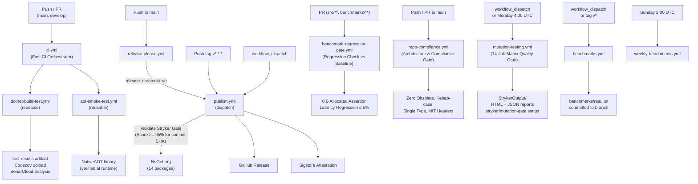

# CI/CD Pipelines and Quality Gates

This document describes the Continuous Integration and Continuous Delivery infrastructure for `EricksonLopez.DomainPrimitives`. All workflow definitions live in [`.github/workflows/`](../.github/workflows/).

---

## Workflow Architecture

The pipeline follows a **reusable-workflow pattern**: the entry-point orchestrators (`ci.yml`, `release-please.yml`) delegate actual work to reusable workflows. This eliminates duplication across push, PR, publish, and benchmark triggers.

---

## Workflow Reference

### `ci.yml` — Main CI Orchestrator

| Property | Value |
|----------|-------|
| **File** | [`.github/workflows/ci.yml`](../.github/workflows/ci.yml) |
| **Trigger** | `push` to `main`, `develop`; `pull_request` targeting `main`, `develop` |
| **Runner** | Delegates to reusable workflows |

This is a thin orchestrator. It calls two reusable workflows in parallel and passes secrets through:

| Job | Calls | Secrets forwarded |
|-----|-------|-------------------|
| `build-and-test` | `dotnet-build-test.yml` | `SNK_KEY`, `CODECOV_TOKEN`, `SONAR_TOKEN` |
| `aot-smoke-test` | `aot-smoke-test.yml` | `SNK_KEY` |

---

### `dotnet-build-test.yml` — Reusable Build & Test

| Property | Value |
|----------|-------|
| **File** | [`.github/workflows/dotnet-build-test.yml`](../.github/workflows/dotnet-build-test.yml) |
| **Trigger** | `workflow_call` only (called by `ci.yml`) |
| **Runner** | `ubuntu-latest` |

#### Inputs

| Input | Type | Default | Description |
|-------|------|---------|-------------|
| `dotnet-version` | `string` | `10.0.x` | .NET SDK version to install |
| `test-filter` | `string` | `""` | dotnet test `--filter` expression |
| `test-project` | `string` | `""` | Specific test project path (empty = all) |
| `upload-coverage` | `boolean` | `true` | Upload coverage to Codecov |
| `artifact-name` | `string` | `test-results` | Name for the uploaded test results artifact |

#### Secrets

| Secret | Required | Purpose |
|--------|----------|---------|
| `SNK_KEY` | Optional | Base64-encoded `.snk` for strong-name signing |
| `CODECOV_TOKEN` | Optional | Codecov upload token |
| `SONAR_TOKEN` | Optional | SonarCloud token |

#### Steps

| # | Step | Purpose |
|---|------|---------|
| 1 | Checkout | `actions/checkout@v4` |
| 2 | Setup .NET | `actions/setup-dotnet@v4` — version from input |
| 3 | Restore Strong Name key | Decodes `SNK_KEY` secret → `EricksonLopez.snk` |
| 4 | Restore | `dotnet restore EricksonLopez.DomainPrimitives.slnx` |
| 5 | Setup Java 17 | Required for SonarScanner (Zulu distribution) |
| 6 | Install SonarScanner | `dotnet tool install --global dotnet-sonarscanner` |
| 7 | Begin Sonar Analysis | `dotnet sonarscanner begin` (guarded: skipped if `SONAR_TOKEN` is empty) |
| 8 | **Build (Release)** | `dotnet build --no-restore --configuration Release` |
| 9 | **API Compatibility Check** | `dotnet pack EricksonLopez.DomainPrimitives.slnx --no-build --configuration Release` — detects multi-targeting package errors (P1 Gate) |
| 10 | **API Surface Budget Gate** | `dotnet test tests/EricksonLopez.DomainPrimitives.UnitTests --filter "Category=ApiSurfaceBudget"` — enforces member count budgets (P2 Gate) |
| 11 | **Run Tests** | `dotnet test --no-build --configuration Release --collect:"XPlat Code Coverage"` — opencover + cobertura formats |
| 12 | End Sonar Analysis | `dotnet sonarscanner end` (guarded: skipped if `SONAR_TOKEN` is empty) |
| 13 | Upload test results | `actions/upload-artifact@v4` → `{artifact-name}` |
| 14 | Upload coverage to Codecov | `codecov/codecov-action@v4` with `fail_ci_if_error: false` |

#### Artifacts Produced

| Artifact | Path | Retention |
|----------|------|-----------|
| Test results | `./test-results/` | Default (90 days) |
| Coverage (opencover) | `**/coverage.opencover.xml` | Uploaded to Codecov |
| Coverage (cobertura) | `**/coverage.cobertura.xml` | Uploaded to Codecov |

---

### `aot-smoke-test.yml` — NativeAOT Smoke Test

| Property | Value |
|----------|-------|
| **File** | [`.github/workflows/aot-smoke-test.yml`](../.github/workflows/aot-smoke-test.yml) |
| **Trigger** | `workflow_call`; `push`/`pull_request` to `main`, `develop`; `workflow_dispatch` |
| **Runner** | `ubuntu-latest` |
| **Timeout** | 20 minutes |

Installs NativeAOT prerequisites (`clang`, `lld`, `zlib1g-dev`), builds the solution, publishes the `AotSmokeTest` project (`tests/EricksonLopez.DomainPrimitives.AotSmokeTest/EricksonLopez.DomainPrimitives.AotSmokeTest.csproj` with `--runtime linux-x64 --self-contained`), and executes the resulting native binary to verify zero-allocation correctness at runtime.

| Secret | Required |
|--------|----------|
| `SNK_KEY` | Optional |

On failure, the AOT output directory is uploaded as a diagnostic artifact (7-day retention).

---

### `publish.yml` — Pack & Publish to NuGet

| Property | Value |
|----------|-------|
| **File** | [`.github/workflows/publish.yml`](../.github/workflows/publish.yml) |
| **Trigger** | `push` of tags matching `v*.*.*`; `workflow_dispatch` with optional `version` input |
| **Runner** | `ubuntu-latest` |
| **Permissions** | `id-token: write`, `contents: write`, `attestations: write`, `statuses: read`, `actions: read` |

#### Version Resolution (in order of precedence)

1. `workflow_dispatch` input `version` (if provided)
2. Git tag name (strip `v` prefix) if triggered by a tag push
3. `VersionPrefix` parsed from `Directory.Build.props` (fallback)

#### Steps

| # | Step | Purpose |
|---|------|---------|
| 1 | Checkout (full history) | `actions/checkout@v4` with `fetch-depth: 0` for tag and history access |
| 2 | Resolve version | Sets `VERSION` output from tag / input / `Directory.Build.props` |
| 3 | **Validate Stryker Gate** | `actions/github-script@v7` invoking `./scripts/verify-mutation-gate.js` to verify commit SHA has score ≥ 95% |
| 4 | Setup .NET | `actions/setup-dotnet@v4` with `10.0.x` |
| 5 | Restore Strong Name key | Decodes `SNK_KEY` → `EricksonLopez.snk` |
| 6 | Restore | `dotnet restore EricksonLopez.DomainPrimitives.slnx` |
| 7 | Build (Release) | `dotnet build --configuration Release` |
| 8 | **Run tests** | `dotnet test --configuration Release --no-build --collect:"XPlat Code Coverage"` |
| 9 | Upload coverage to Codecov | `codecov/codecov-action@v4` publish-gate coverage snapshot |
| 10 | **Pack All 14 Packages** | `dotnet pack` with `VersionPrefix=$VERSION` for each package |
| 11 | **Sigstore Attestation** | `actions/attest-build-provenance@v2` — cryptographic attestation for all `.nupkg` files |
| 12 | NuGet login (OIDC) | `NuGet/login@v1` — short-lived token via GitHub OIDC (no static API key) |
| 13 | Push to NuGet.org | `dotnet nuget push --skip-duplicate` |
| 14 | Create GitHub Release | `softprops/action-gh-release@v2` (tag-triggered only); `prerelease=true` if version contains `-` |

#### Secrets

| Secret | Required | Purpose |
|--------|----------|---------|
| `SNK_KEY` | Optional | Strong-name signing |
| `CODECOV_TOKEN` | Optional | Coverage upload |
| `GITHUB_TOKEN` | Auto | Release creation and commit status inspection |

---

### `release-please.yml` — Automated Release Management

| Property | Value |
|----------|-------|
| **File** | [`.github/workflows/release-please.yml`](../.github/workflows/release-please.yml) |
| **Trigger** | `push` to `main` |
| **Permissions** | `contents: write`, `pull-requests: write` |

Uses [`googleapis/release-please-action@v4`](https://github.com/googleapis/release-please-action) with config from [`.release-please-config.json`](../.release-please-config.json) and manifest from [`.release-please-manifest.json`](../.release-please-manifest.json).

When a release is created (`release_created=true`), a `trigger-publish` job dispatches `publish.yml` via the GitHub API, passing the resolved `major.minor.patch` version. This creates a clean two-stage pipeline: merge → release PR → tag → publish.

---

### `mutation-testing.yml` — Stryker Mutation Testing (14-Job Matrix Quality Gate)

| Property | Value |
|----------|-------|
| **File** | [`.github/workflows/mutation-testing.yml`](../.github/workflows/mutation-testing.yml) |
| **Trigger** | `workflow_dispatch` (mutation-level: Basic, Standard, Advanced); `schedule: cron: "0 4 * * 1"` (Mondays at 4:00 UTC) |
| **Runner** | `ubuntu-latest` |
| **Timeout** | 480 minutes (8 hours) |
| **Concurrency** | `group: mutation-testing-${{ github.ref }}`, `cancel-in-progress: true` |
| **Permissions** | `contents: read` |

#### Architectural Design: 14-Job Parallel Matrix
- **Decoupled from PRs & Pushes:** Fast CI passes without waiting for Stryker. The mutation suite runs weekly and on-demand before releases.
- **14-Package Matrix:** Rather than a monolithic run, the workflow fans out into 14 parallel matrix jobs targeting each package individually:
  1. `Core`: `stryker-config.json` → `StrykerOutput/core`
  2. `Abstractions`: `stryker-abstractions-config.json` → `StrykerOutput/abstractions`
  3. `Generators`: `stryker-generators-config.json` → `StrykerOutput/generators`
  4. `Analyzers`: `stryker-analyzers-config.json` → `StrykerOutput/analyzers`
  5. `AspNetCore`: `stryker-aspnetcore-config.json` → `StrykerOutput/aspnetcore`
  6. `AspNetCoreSourceGen`: `stryker-aspnetcore-sourcegen-config.json` → `StrykerOutput/aspnetcore-sourcegen`
  7. `EFCore`: `stryker-efcore-config.json` → `StrykerOutput/efcore`
  8. `EFCoreSourceGen`: `stryker-efcore-sourcegen-config.json` → `StrykerOutput/efcore-sourcegen`
  9. `Dapper`: `stryker-dapper-config.json` → `StrykerOutput/dapper`
  10. `DapperSourceGen`: `stryker-dapper-sourcegen-config.json` → `StrykerOutput/dapper-sourcegen`
  11. `OpenApi`: `stryker-openapi-config.json` → `StrykerOutput/openapi`
  12. `OpenApiSourceGen`: `stryker-openapi-sourcegen-config.json` → `StrykerOutput/openapi-sourcegen`
  13. `NewtonsoftJson`: `stryker-newtonsoftjson-config.json` → `StrykerOutput/newtonsoftjson`
  14. `Testing`: `stryker-testing-config.json` → `StrykerOutput/testing`
- **Artifacts & Persistence:** Each job uploads its dedicated `mutation-report.html` and `mutation-report.json` as separate GitHub artifacts.
- **Release Gating:** `publish.yml` executes `verify-mutation-gate.js`, ensuring that the commit being published has passed all required Stryker break thresholds ($\ge 95\%$).

#### Quality Thresholds (from `stryker-*.json`)

| Level | Threshold | Status | Action |
|-------|-----------|--------|--------|
| High | ≥ 100% | `✅ HIGH` | Pass |
| Low | ≥ 98% | `🟡 LOW` | Pass |
| Warning | ≥ 95% && < 98% | `🟠 WARNING` | Pass (Approaching break threshold) |
| **Break** | **< 95%** | `❌ FAILED` | **Hard Gate Fail** (blocks CI & releases) |

---

### `benchmarks.yml` — Performance Benchmark Capture

| Property | Value |
|----------|-------|
| **File** | [`.github/workflows/benchmarks.yml`](../.github/workflows/benchmarks.yml) |
| **Trigger** | `workflow_dispatch`; `push` of tags matching `v*` |
| **Runner** | `ubuntu-latest` |
| **Timeout** | 60 minutes |
| **Permissions** | `contents: write` (to commit results) |

Installs .NET **8.0.x**, **9.0.x**, and **10.0.x** simultaneously. Runs benchmarks against all three runtimes (`--runtimes net8.0 net9.0 net10.0`) with `--job short`. Results are exported as JSON and Markdown to `benchmarks/results/`. If `commit-results=true`, the results are committed back to the triggering branch with `[skip ci]`.

---

### `weekly-benchmarks.yml` — Deep Weekly Benchmark Review

| Property | Value |
|----------|-------|
| **File** | [`.github/workflows/weekly-benchmarks.yml`](../.github/workflows/weekly-benchmarks.yml) |
| **Trigger** | `schedule: cron: "0 2 * * 0"` (Sundays at 2:00 UTC); `workflow_dispatch` |
| **Runner** | `ubuntu-latest` |
| **Timeout** | 300 minutes (5 hours) |
| **Permissions** | `contents: write` |

Runs the full benchmark suite for a comprehensive deep review without `--job short`. Results are committed back to the branch if the run succeeds.

---

### `benchmark-regression-gate.yml` — Pull Request Benchmark Regression Gate

| Property | Value |
|----------|-------|
| **File** | [`.github/workflows/benchmark-regression-gate.yml`](../.github/workflows/benchmark-regression-gate.yml) |
| **Trigger** | `pull_request` targeting `main`, `develop` (paths: `src/**`, `benchmarks/**`); `workflow_dispatch` (optional input: `threshold`, default: 5%) |
| **Runner** | `ubuntu-latest` |
| **Timeout** | 45 minutes |

#### Steps
1. **Multi-SDK Setup:** Installs .NET `8.0.x`, `9.0.x`, and `10.0.x`.
2. **Build:** Restores and builds the solution in Release configuration.
3. **Execute Benchmarks:** Executes `BenchmarkDotNet` for the PR head commit (`--filter "*" --job short --exporters json --memory --artifacts ./benchmarks/pr-results`).
4. **Evaluate Assertion Script:** Runs `./scripts/verify-benchmark-gate.ps1`:
   - Enforces the **Zero Heap Allocation Invariant**: Hot path combinators must allocate **0 bytes**.
   - Enforces the **Latency Regression Threshold**: Mean execution latency must not regress by more than 5% compared to `benchmarks/results/baseline.json`.
5. **Artifacts:** Uploads PR benchmark results as `pr-benchmark-results-${{ github.run_id }}` (30-day retention).

---

### `repo-compliance.yml` — Repository Architecture & Quality Gate

| Property | Value |
|----------|-------|
| **File** | [`.github/workflows/repo-compliance.yml`](../.github/workflows/repo-compliance.yml) |
| **Trigger** | `push` to `main`; `pull_request` targeting `main`; `workflow_dispatch` |
| **Runner** | `ubuntu-latest` |
| **Timeout** | 15 minutes |

#### Automated Audit Dimensions
1. **Architecture & Governance Script:** Executes `./scripts/verify-compliance.ps1` verifying:
   - Kebab-case file naming for all documentation in `docs/`.
   - Zero `[Obsolete]` attribute usages in production code (`src/`).
   - Presence of the canonical MIT copyright header across all source files.
   - One top-level type per file invariant in `src/`.
   - Accurate GitHub identity links (`ericksonlopezf/dotnet-domain-primitives`).
   - Normalized contact and security email addresses (`ericksonlopezf@gmail.com`).
   - Zero prohibited `<NoWarn>` suppressions in MSBuild files.
2. **Strict Compilation:** Restores and compiles solution with `TreatWarningsAsErrors=true`.
3. **Unit Tests:** Executes the full unit test suite with high verbosity.
4. **Packaging Validation:** Executes `dotnet pack` to confirm all 14 packages produce valid `.nupkg` artifacts without packaging warnings.

---

## Quality Gates

### Compiler Quality

| Setting | Value | Location |
|---------|-------|----------|
| `TreatWarningsAsErrors` | `true` | `Directory.Build.props` |
| `WarningLevel` | `5` | `Directory.Build.props` |
| `AnalysisLevel` | `latest-recommended` | `Directory.Build.props` |
| `LangVersion` | `14` | `Directory.Build.props` |
| `EnforceCodeStyleInBuild` | `true` | `Directory.Build.props` |

### Code Coverage

| Tool | Configuration | Upload |
|------|--------------|--------|
| Coverlet | `XPlat Code Coverage` collector; opencover + cobertura formats | Codecov via `codecov/codecov-action@v4` |
| `fail_ci_if_error` | `false` | Coverage failures do not block CI |

### Static Analysis (SonarCloud)

Enabled when `SONAR_TOKEN` secret is configured. Analysis wraps the build + test steps in begin/end mode. Coverage forwarded via `sonar.cs.opencover.reportsPaths`.

| Property | Value |
|----------|-------|
| Organization | `ericksonlopezf` |
| Project key | `ericksonlopezf_{repository.name}` |
| Host | `https://sonarcloud.io` |

### API Compatibility (Package Validation)

| Setting | Value |
|---------|-------|
| `EnablePackageValidation` | `true` for all packable projects |
| Failure mode | CI fails if binary-breaking change detected vs baseline |

### API Surface Budget Gate

Tests filtered by `[Trait("Category", "ApiSurfaceBudget")]` are run as a dedicated CI step. These tests verify that no generated struct exceeds the member count budget (≤ 35 members for StringPrimitive, ≤ 38 for NumericPrimitive, ≤ 40 for StrongId, ≤ 37 for DatePrimitive).

### Mutation Testing (Stryker.NET)

| Threshold | Value | Status |
|-----------|-------|--------|
| High | ≥ 100% | `✅ HIGH` |
| Low | ≥ 98% | `🟡 LOW` |
| Warning | ≥ 95% | `🟠 WARNING` |
| **Break (Quality Gate)** | **< 95%** | `❌ FAILED` |
| Coverage analysis | Off | |
| Concurrency | 2 | |
| Target framework | `net8.0` | |

---

## Supply Chain Security

| Mechanism | Implementation |
|-----------|---------------|
| **NuGet Trusted Publishing (OIDC)** | `NuGet/login@v1` — short-lived token via GitHub OIDC; no static API key stored |
| **Sigstore Provenance Attestation** | `actions/attest-build-provenance@v2` — cryptographic attestation linking each `.nupkg` to its specific CI run and source commit |
| **Strong Name Signing** | `EricksonLopez.snk` key stored as `SNK_KEY` secret; decoded at build time; conditional on secret presence |
| **Deterministic Builds** | `<Deterministic>true</Deterministic>` + `<ContinuousIntegrationBuild>true</ContinuousIntegrationBuild>` when `CI=true` |
| **Source Link** | `Microsoft.SourceLink.GitHub` — embeds source control metadata in PDB/snupkg |
| **NuGet Audit** | `<NuGetAudit>true</NuGetAudit>` + `<NuGetAuditMode>all</NuGetAuditMode>` + `<NuGetAuditLevel>low</NuGetAuditLevel>` at restore time |
| **Dependency Updates** | Dependabot: NuGet weekly (Monday) + GitHub Actions weekly (Monday) |

---

## Branch Strategy

Branches observed in CI trigger configurations:

| Branch | Role |
|--------|------|
| `main` | Protected; merge triggers `release-please.yml`; PRs and direct pushes run `ci.yml` |
| `develop` | Integration branch; PRs and direct pushes run `ci.yml` |

---

## Secrets Reference

| Secret | Used in | Required | Purpose |
|--------|---------|----------|---------|
| `SNK_KEY` | All build workflows | Optional | Base64-encoded `EricksonLopez.snk` strong-name key |
| `CODECOV_TOKEN` | `dotnet-build-test.yml`, `publish.yml` | Optional | Codecov upload authentication |
| `SONAR_TOKEN` | `dotnet-build-test.yml` | Optional | SonarCloud analysis (steps guarded) |
| `GITHUB_TOKEN` | `publish.yml`, `release-please.yml`, `mutation-testing.yml` | Auto-injected | Release creation, commit status, PR management |
