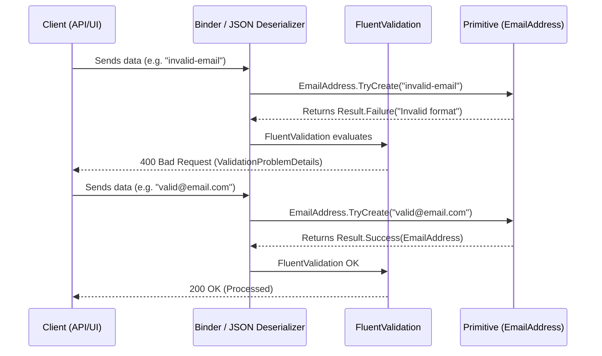
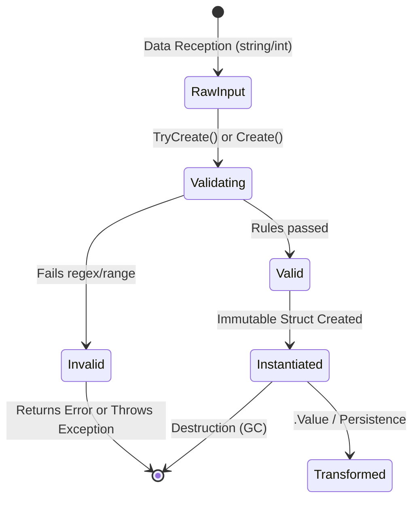
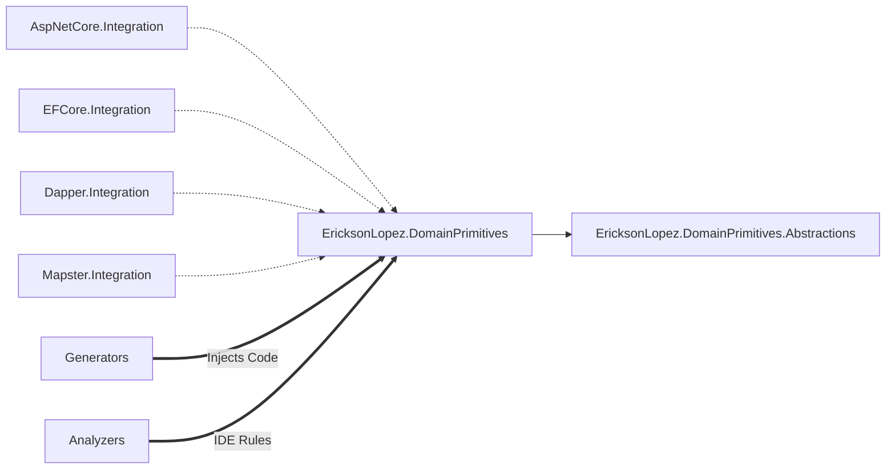
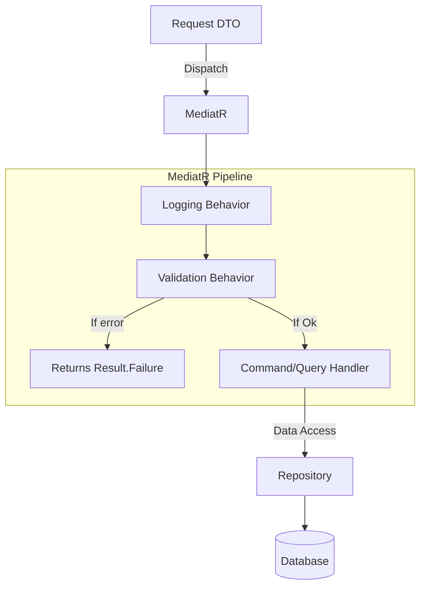

# 📊 Architecture and Flow Diagrams

## 1. General Architecture and Main Flow
*See [Functional Map](functional-map.md)*.

## 2. Validation Sequence (Error Handling)

## 3. Primitive States (Lifecycle)

## 4. Component Dependencies (Pipeline)

## 5. Processing and Pipeline Behaviors (MediatR)

