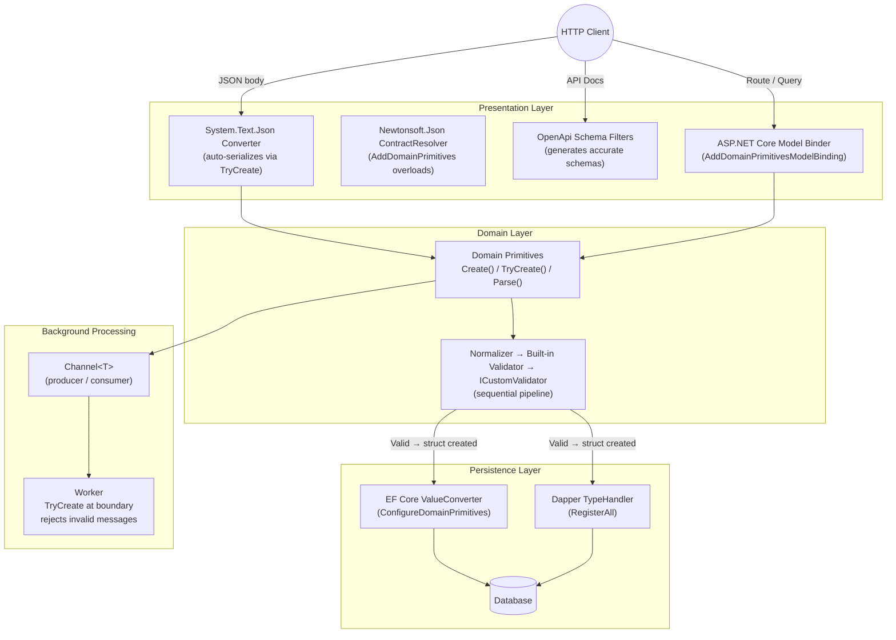
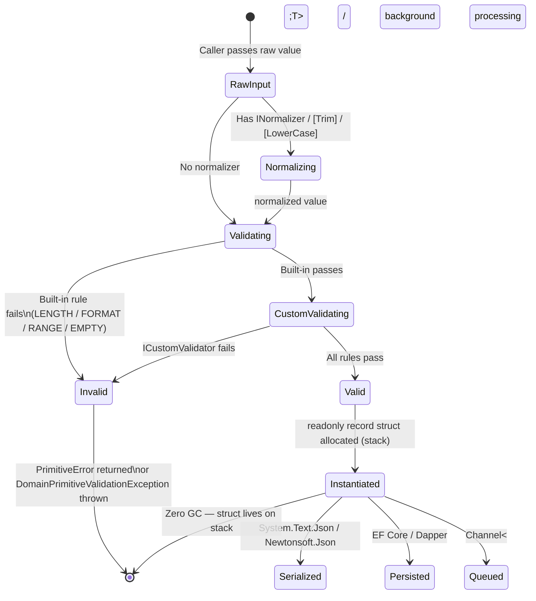
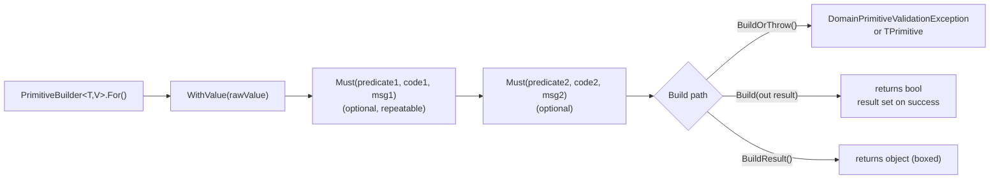
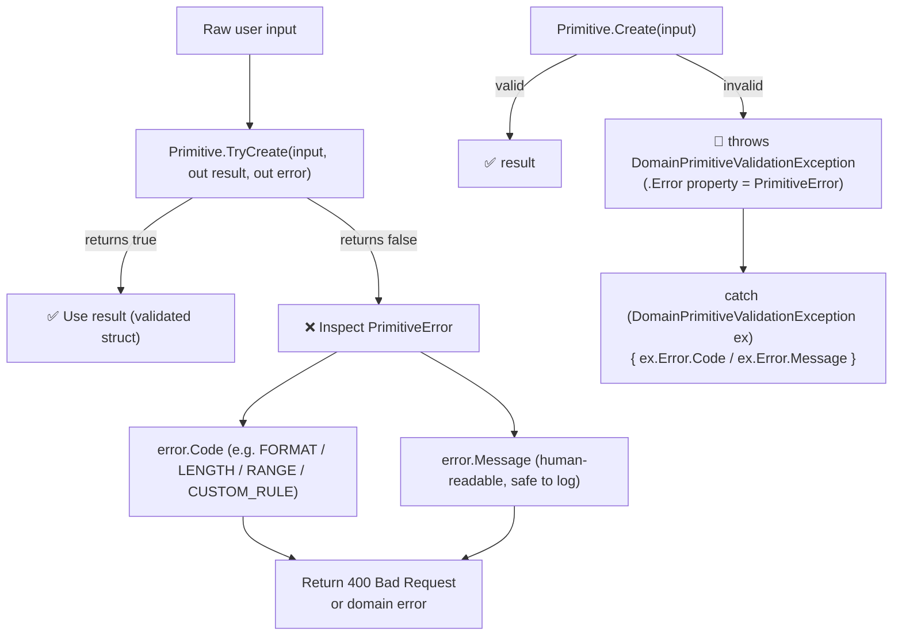
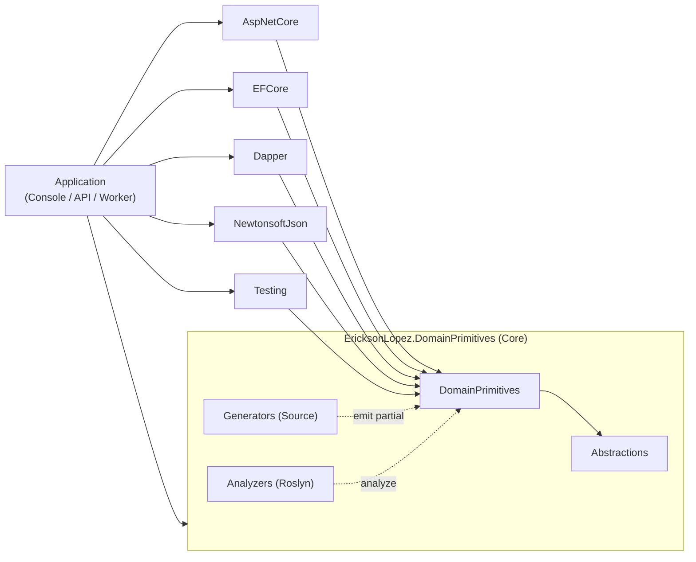

# Architecture and Flow Diagrams

> All diagrams reflect the actual architecture discovered in the `EricksonLopez.DomainPrimitives` repository (Fase 0–1 inventory). No hypothetical patterns are depicted.

---

## 1. General Architecture (Package Ecosystem)

```mermaid
graph TD
    subgraph Core ["Core Library"]
        Abstractions["EricksonLopez.DomainPrimitives.Abstractions\n(Interfaces, PrimitiveError, PrimitiveBuilder,\nPrimitiveCollectionExtensions, Attributes)"]
        Core["EricksonLopez.DomainPrimitives\n(Validation pipeline, Normalizers,\nShortcut Attributes, DomainPrimitivesDefaults)"]
        Gen["EricksonLopez.DomainPrimitives.Generators\n(Roslyn Source Generator → emits partial structs)"]
        Anl["EricksonLopez.DomainPrimitives.Analyzers\n(DP0001-DP0017 diagnostics, IDE enforcement)"]
    end

    subgraph Infra ["Infrastructure Packages"]
        AspNet["AspNetCore\n(DomainPrimitiveModelBinder,\nAddDomainPrimitivesModelBinding)"]
        EFCore["EFCore\n(ValueConverter auto-registration\nvia ConfigureDomainPrimitives)"]
        Dapper["Dapper\n(TypeHandler auto-registration\nvia DapperDomainPrimitivesRegistration.RegisterAll)"]
        OpenApi["OpenApi\n(Schema filters for Swagger)"]
        Newtonsoft["NewtonsoftJson\n(AddDomainPrimitives overloads)"]
    end

    subgraph Test ["Testing Package"]
        Testing["EricksonLopez.DomainPrimitives.Testing\n(FakeFactory, TestBuilder, Scenarios,\nAssertionsExtensions, VerifyExtensions)"]
    end

    Core --> Abstractions
    Gen ==>|"compile-time\ncode generation"| Core
    Anl ==>|"IDE diagnostics"| Core

    AspNet --> Core
    EFCore --> Core
    Dapper --> Core
    OpenApi --> Core
    Newtonsoft --> Core
    Testing --> Core
```

---

## 2. Main Application Flow



---

## 3. Primitive Creation Pipeline (Sequence)

```mermaid
sequenceDiagram
    participant C as Caller
    participant P as Primitive (partial record struct)
    participant N as INormalizer&lt;T&gt; (optional)
    participant V as Built-in Validators
    participant CV as ICustomValidator&lt;T&gt; (optional)

    C->>P: TryCreate(rawValue)
    alt Has INormalizer
        P->>N: Normalize(rawValue)
        N-->>P: normalizedValue
    end
    P->>V: Apply [Trim]/[LowerCase]/[MaxLength]/[Regex]/[PrimitiveRange]...
    alt Built-in validation fails
        V-->>P: PrimitiveError (CODE, message)
        P-->>C: returns false + error
    end
    alt Has ICustomValidator
        P->>CV: Validate(normalizedValue)
        alt Custom validation fails
            CV-->>P: PrimitiveError
            P-->>C: returns false + error
        end
    end
    P-->>C: returns true + readonly record struct
```

---

## 4. Primitive Lifecycle States



---

## 5. PrimitiveBuilder Fluent Pipeline



---

## 6. Error Handling Flow



---

## 7. Background Processing Pattern

```mermaid
sequenceDiagram
    participant Producer as Producer\n(Controller / Service)
    participant Channel as Channel&lt;RawMessage&gt;
    participant Worker as Background Worker
    participant Domain as Domain Primitives

    Producer->>Channel: writer.WriteAsync(new RawMessage(...))
    loop Worker loop
        Channel-->>Worker: reader.ReadAsync() → RawMessage
        Worker->>Domain: OrderId.TryCreate(raw.OrderId)
        alt TryCreate fails
            Domain-->>Worker: returns false + PrimitiveError
            Worker->>Worker: Log.Warning + skip message
        else TryCreate succeeds
            Domain-->>Worker: returns true + OrderId
            Worker->>Worker: Build DomainOrderMessage
            Worker->>Worker: Process validated domain message
        end
    end
```

---

## 8. Component Dependency Graph


