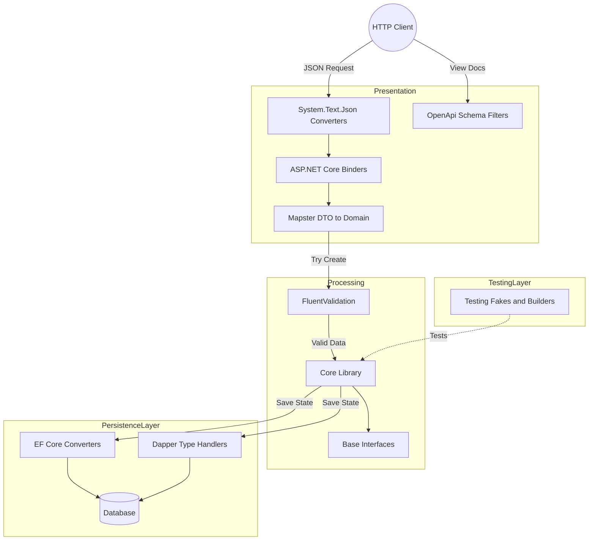

# Architecture Functional Map

This functional map details the data lifecycle when using the `EricksonLopez.DomainPrimitives` library across the different layers of a modern application (e.g., Clean Architecture with ASP.NET Core).

## Application Main Flow

## Layer Explanations

### 1. Entry Point (Presentation Layer)
HTTP requests enter through ASP.NET Core. The Domain Primitives' inline `System.Text.Json` converter deserializes the domain primitives from JSON. `EricksonLopez.DomainPrimitives.OpenApi` correctly exposes the documentation.

### 2. Validation & Mapping Layer
Through `EricksonLopez.DomainPrimitives.Mapster`, the data is validated and mapped to the domain.

### 3. Processing Layer (Domain)
At the core of the system, `EricksonLopez.DomainPrimitives` encapsulates the business logic.

### 4. Persistence Layer
- **Dapper:** Uses Type Handlers.
- **Entity Framework Core:** Uses ValueConverters.

### 5. Clean-up & Testing Layer
`EricksonLopez.DomainPrimitives.Testing` allows the injection of fakes and generates assertions.
