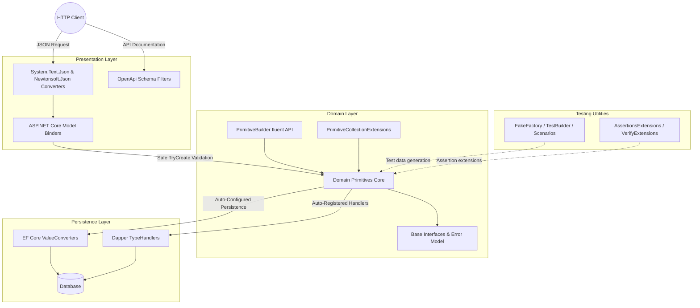

# Architecture Functional Map

This functional map details the data lifecycle when using the `EricksonLopez.DomainPrimitives` ecosystem across application layers (e.g., Clean Architecture with ASP.NET Core).

## Application Main Flow

## Layer Explanations

### 1. Presentation Layer
HTTP requests enter through ASP.NET Core. Built-in `System.Text.Json` or `Newtonsoft.Json` converters deserialize primitives directly into domain types. `EricksonLopez.DomainPrimitives.OpenApi` generates OpenAPI/Swagger schemas accurately depicting primitives by their underlying scalar types. Model binding is registered via `services.AddDomainPrimitivesModelBinding()` or `options.AddDomainPrimitivesModelBinding()`.

### 2. Domain Processing Layer
At the core, `EricksonLopez.DomainPrimitives` encapsulates all validation rules, invariants, and normalization within immutable structs:
- **Factory methods**: `Create()`, `TryCreate()`, `Parse()`, `TryParse()` guard all state transitions.
- **Normalization pipeline**: `INormalizer<T>` + `[Normalize<TNorm>]` runs before built-in validators; `ICustomValidator<T>` + `[CustomValidator<TVal>]` runs after.
- **Assembly defaults**: `[assembly: DomainPrimitivesDefaults(Trim, NotEmpty, MaxLength)]` sets global string defaults; per-type attributes override them.
- **PrimitiveBuilder**: `PrimitiveBuilder<TPrimitive, TValue>.For().WithValue(...).Must(...).BuildOrThrow()` provides a fluent API for programmatic construction.
- **PrimitiveCollectionExtensions**: `ToDomainPrimitiveList<>()` and `ToDomainPrimitiveArray<>()` (IEnumerable and ReadOnlySpan overloads) bulk-convert raw collections.

### 3. Persistence Layer
- **Dapper:** Uses source-generated `SqlMapper.TypeHandler<T>` registered via `DapperDomainPrimitivesRegistration.RegisterAll()` (emitted into `EricksonLopez.DomainPrimitives.Dapper.Generated`).
- **Entity Framework Core:** Uses source-generated `ValueConverter<T, TValue>` auto-discovered via `ConfigureDomainPrimitives()`.

### 4. Testing Layer
`EricksonLopez.DomainPrimitives.Testing` provides:
- **`DomainPrimitiveFakeFactory`**: Pre-built arrays of valid/invalid inputs (`Strings`, `Numerics`, `Dates`, `Identifiers`).
- **`DomainPrimitiveTestBuilder`**: `Create<>()`, `AssertCreationFails<>()`, `CreateUnvalidated<>()`.
- **`DomainPrimitiveScenarios`**: Parameterized-test scenario arrays (`ValidEmailInputs`, `InvalidEmailInputs`, `EmailNormalizationScenarios`, etc.).
- **`DomainPrimitiveAssertionsExtensions`**: xUnit/AwesomeAssertions-based assertions (`HavePrimitiveValue<>`, `ThrowDomainPrimitiveException`, etc.).
- **`DomainPrimitiveVerifyExtensions`**: Snapshot testing integration via `Initialize()`.
