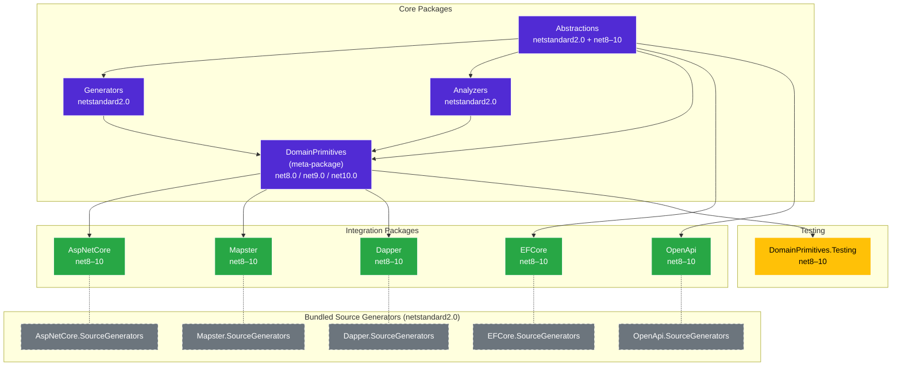

# NuGet Packages

`EricksonLopez.DomainPrimitives` is published as a family of 15 coordinated NuGet packages. All packages share the same version number and are released simultaneously.

---

## Package Overview

### Core Packages

These three packages form the foundation. Most consumers only need `EricksonLopez.DomainPrimitives`.

| Package ID | TFMs | Role |
|-----------|------|------|
| `EricksonLopez.DomainPrimitives` | `net8.0; net9.0; net10.0` | **Meta-package** — the single install for most users. Bundles Abstractions + Generators + Analyzers. |
| `EricksonLopez.DomainPrimitives.Abstractions` | `netstandard2.0; net8.0; net9.0; net10.0` | Marker interfaces, declaration attributes, validation attributes, normalization attributes, `PrimitiveError`. Zero external dependencies. |
| `EricksonLopez.DomainPrimitives.Generators` | `netstandard2.0` | Roslyn Incremental Source Generator (`IIncrementalGenerator`). Compile-time only — no runtime reference. |
| `EricksonLopez.DomainPrimitives.Analyzers` | `netstandard2.0` | Roslyn Analyzers — enforce correct usage, API surface budget (DP0001–DP0099). Compile-time only. |

> [!NOTE]
> `Generators` and `Analyzers` are referenced by the meta-package as `OutputItemType="Analyzer" ReferenceOutputAssembly="false"`. They add zero runtime overhead.

---

### Integration Packages

Each integration package contains both the runtime component and its own source generator (bundled as an `analyzers/dotnet/cs` asset). The generators enable **auto-discovery** — no per-type annotation is required in your domain layer.

| Package ID | TFMs | Integrates With | Auto-discovery |
|-----------|------|-----------------|:-:|
| `EricksonLopez.DomainPrimitives.AspNetCore` | `net8.0; net9.0; net10.0` | ASP.NET Core model binding, route parameters, query strings | ✅ |
| `EricksonLopez.DomainPrimitives.AspNetCore.SourceGenerators` | `netstandard2.0` | Roslyn generator bundled inside AspNetCore package | — |
| `EricksonLopez.DomainPrimitives.EFCore` | `net8.0; net9.0; net10.0` | Entity Framework Core `ValueConverter<TDomain, TValue>` | ✅ |
| `EricksonLopez.DomainPrimitives.EFCore.SourceGenerators` | `netstandard2.0` | Roslyn generator bundled inside EFCore package | — |
| `EricksonLopez.DomainPrimitives.Dapper` | `net8.0; net9.0; net10.0` | Dapper `SqlMapper.TypeHandler<T>` | ✅ |
| `EricksonLopez.DomainPrimitives.Dapper.SourceGenerators` | `netstandard2.0` | Roslyn generator bundled inside Dapper package | — |
| `EricksonLopez.DomainPrimitives.Mapster` | `net8.0; net9.0; net10.0` | Mapster type mapping for composite `[ValueObject]` types | ✅ |
| `EricksonLopez.DomainPrimitives.Mapster.SourceGenerators` | `netstandard2.0` | Roslyn generator bundled inside Mapster package | — |
| `EricksonLopez.DomainPrimitives.OpenApi` | `net8.0; net9.0; net10.0` | Swagger/OpenAPI schema filters (`Swashbuckle.AspNetCore`) | ✅ |
| `EricksonLopez.DomainPrimitives.OpenApi.SourceGenerators` | `netstandard2.0` | Roslyn generator bundled inside OpenApi package | — |

> [!NOTE]
> **EFCore and OpenApi** depend on `EricksonLopez.DomainPrimitives.Abstractions` directly (not the meta-package) because they only need marker interfaces for type detection. **AspNetCore, Dapper, Mapster, and Testing** depend on the `EricksonLopez.DomainPrimitives` meta-package.

> [!NOTE]
> **Mapster scalar primitives:** For scalar types (`[StringPrimitive]`, `[StrongId]`, `[NumericPrimitive<T>]`), Mapster resolves the generated `explicit operator` automatically — **no package needed**. Add `EricksonLopez.DomainPrimitives.Mapster` only for composite `[ValueObject]` types or AOT source-generation mode. See [ADR-017](adr/ADR-017-mapster-integration-rationale.md).

---

### Testing Package

| Package ID | TFMs | Role |
|-----------|------|------|
| `EricksonLopez.DomainPrimitives.Testing` | `net8.0; net9.0; net10.0` | Test helpers: assertions, builders (`PrimitiveBuilder<T,V>`), fakes. Integrates with xUnit, AwesomeAssertions, NSubstitute, Verify.Xunit. |

---

## Dependency Graph



---

## Installation

### Typical Application (Web API / Worker)

```bash
# Core — domain primitives
dotnet add package EricksonLopez.DomainPrimitives

# Add integrations as needed:
dotnet add package EricksonLopez.DomainPrimitives.EFCore
dotnet add package EricksonLopez.DomainPrimitives.AspNetCore
dotnet add package EricksonLopez.DomainPrimitives.Dapper
dotnet add package EricksonLopez.DomainPrimitives.OpenApi
dotnet add package EricksonLopez.DomainPrimitives.Mapster

# For tests:
dotnet add package EricksonLopez.DomainPrimitives.Testing
```

### Shared Contract Library (netstandard2.0 compatible)

```bash
# Abstractions only — no generators, no runtime dependencies
dotnet add package EricksonLopez.DomainPrimitives.Abstractions
```

---

## Central Package Management (CPM)

This repository uses `Directory.Packages.props` with `<ManagePackageVersionsCentrally>true</ManagePackageVersionsCentrally>`. All dependency versions are pinned centrally.

Key pinned versions (from `Directory.Packages.props`):

| Package | Version |
|---------|---------|
| `Microsoft.CodeAnalysis.CSharp` | `4.11.0` |
| `Microsoft.EntityFrameworkCore` | `8.0.11` / `9.0.0` / `10.0.0` (per TFM) |
| `Mapster` | `7.4.0` |
| `Dapper` | `2.1.35` |
| `Swashbuckle.AspNetCore` | `6.6.2` |
| `xunit` | `2.9.3` |
| `AwesomeAssertions` | `8.0.1` |
| `BenchmarkDotNet` | `0.15.8` |

---

## NuGet Links

All packages are published to [NuGet.org](https://www.nuget.org) under the `EricksonLopez` owner. Links will be active after the first release (v1.0.0).

| Package | NuGet |
|---------|-------|
| `EricksonLopez.DomainPrimitives` | [nuget.org/packages/EricksonLopez.DomainPrimitives](https://www.nuget.org/packages/EricksonLopez.DomainPrimitives) |
| `EricksonLopez.DomainPrimitives.Abstractions` | [nuget.org/packages/EricksonLopez.DomainPrimitives.Abstractions](https://www.nuget.org/packages/EricksonLopez.DomainPrimitives.Abstractions) |
| `EricksonLopez.DomainPrimitives.EFCore` | [nuget.org/packages/EricksonLopez.DomainPrimitives.EFCore](https://www.nuget.org/packages/EricksonLopez.DomainPrimitives.EFCore) |
| `EricksonLopez.DomainPrimitives.AspNetCore` | [nuget.org/packages/EricksonLopez.DomainPrimitives.AspNetCore](https://www.nuget.org/packages/EricksonLopez.DomainPrimitives.AspNetCore) |
| `EricksonLopez.DomainPrimitives.Dapper` | [nuget.org/packages/EricksonLopez.DomainPrimitives.Dapper](https://www.nuget.org/packages/EricksonLopez.DomainPrimitives.Dapper) |
| `EricksonLopez.DomainPrimitives.OpenApi` | [nuget.org/packages/EricksonLopez.DomainPrimitives.OpenApi](https://www.nuget.org/packages/EricksonLopez.DomainPrimitives.OpenApi) |
| `EricksonLopez.DomainPrimitives.Mapster` | [nuget.org/packages/EricksonLopez.DomainPrimitives.Mapster](https://www.nuget.org/packages/EricksonLopez.DomainPrimitives.Mapster) |
| `EricksonLopez.DomainPrimitives.Testing` | [nuget.org/packages/EricksonLopez.DomainPrimitives.Testing](https://www.nuget.org/packages/EricksonLopez.DomainPrimitives.Testing) |
