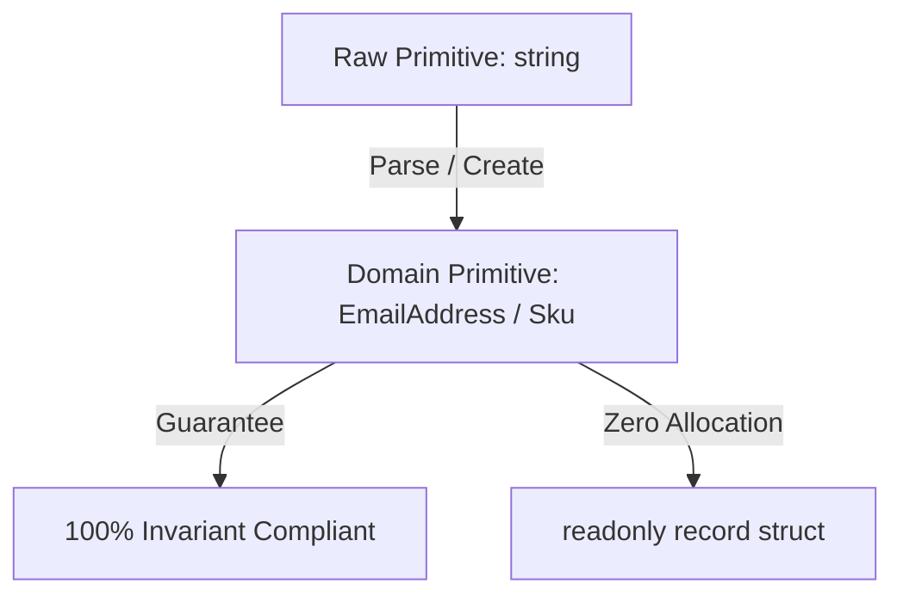

# Level 00 — Architecture & Foundational Philosophy

Welcome to the **EricksonLopez.DomainPrimitives** interactive showcase.

---

## 🎯 What are Domain Primitives?

A **Domain Primitive** is a scalar value object that encapsulates its own validation invariants and semantic meaning. Unlike raw primitives (`string`, `int`, `decimal`), a Domain Primitive guarantees that if an instance exists in memory, it is **provably valid**.

