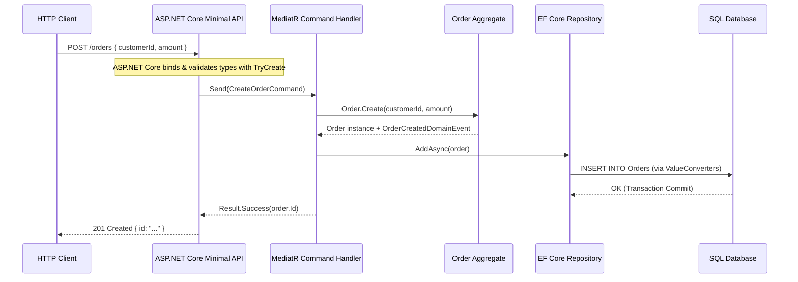

# Level 10 — Enterprise Architecture

This level integrates all capabilities of DomainPrimitives into a comprehensive, production-grade Clean Architecture and Domain-Driven Design (DDD) ecosystem.

---

## 1. Aggregate Roots and DDD Entities

Entities encapsulate internal state using domain primitives, rejecting raw mutable primitive types:

```csharp
public class Order
{
    public OrderId Id { get; private set; }
    public CustomerId CustomerId { get; private set; }
    public OrderAmount TotalAmount { get; private set; }
    public OrderStatus Status { get; private set; }

    private readonly List<IDomainEvent> _domainEvents = new();
    public IReadOnlyCollection<IDomainEvent> DomainEvents => _domainEvents.AsReadOnly();

    public static Order Create(CustomerId customerId, OrderAmount amount)
    {
        var order = new Order
        {
            Id = OrderId.New(),
            CustomerId = customerId,
            TotalAmount = amount,
            Status = OrderStatus.Pending
        };

        order._domainEvents.Add(new OrderCreatedDomainEvent(order.Id, order.CustomerId, order.TotalAmount));
        return order;
    }
}
```

---

## 2. Strongly-Typed Domain Events

Domain events communicate state changes using domain primitives as event payloads, eliminating ambiguity:

```csharp
public record OrderCreatedDomainEvent(
    OrderId OrderId,
    CustomerId CustomerId,
    OrderAmount Amount
) : IDomainEvent;
```

---

## 3. Specification Pattern

Encapsulates domain query rules and filtering logic into reusable, testable specifications:

```csharp
public sealed class PremiumCustomerSpecification : ISpecification<Customer>
{
    public bool IsSatisfiedBy(Customer customer)
    {
        return customer.TotalPurchases.Value >= 1000m && customer.Email.Value.EndsWith("@enterprise.com");
    }
}
```

---

## 4. End-to-End Application Pipeline



---

## Showcase Reference
- Executable projects:
  - [`06-EntitiesAndAggregates`](file:///d:/DevData/ericksonlopez.dev/dotnet-domain-primitives/samples/OfficialSample/06-EntitiesAndAggregates/Program.cs)
  - [`07-DomainEvents`](file:///d:/DevData/ericksonlopez.dev/dotnet-domain-primitives/samples/OfficialSample/07-DomainEvents/Program.cs)
  - [`12-Specifications`](file:///d:/DevData/ericksonlopez.dev/dotnet-domain-primitives/samples/OfficialSample/12-Specifications/Program.cs)
  - [`20-EndToEndApplication`](file:///d:/DevData/ericksonlopez.dev/dotnet-domain-primitives/samples/OfficialSample/20-EndToEndApplication/Program.cs)
