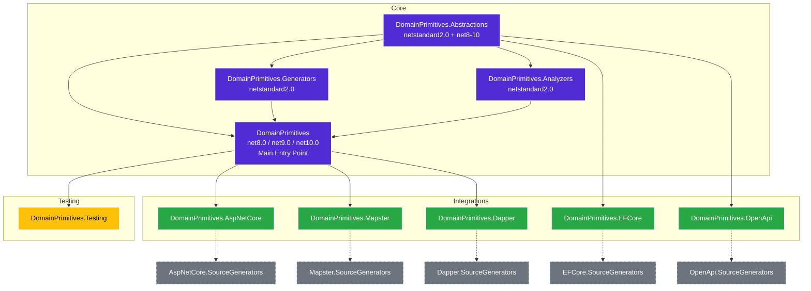

# System Overview

The `EricksonLopez.DomainPrimitives` ecosystem is a zero-allocation, Source-Generator-powered library designed to eliminate Primitive Obsession in .NET applications. It achieves this by providing structural, strongly-typed wrappers for Domain-Driven Design (DDD) Value Objects such as Strongly-Typed IDs, String primitives, Numeric primitives, Date primitives, Value Objects, and Smart Enums.

Unlike traditional runtime-reflection-based approaches, this library relies exclusively on **C# 14+ Incremental Source Generators** (`IIncrementalGenerator`) to emit highly optimized structural wrappers. This makes the library fully compatible with **NativeAOT** and **Trimming**, guaranteeing minimal heap allocations on the hot path.

## High-Level Architecture

The system is structured as a monorepo composed of multiple NuGet packages. The core abstractions and source generators are decoupled from integration packages (like ASP.NET Core, EF Core, etc.) to ensure that consumers only pay for what they use.

### Project Dependency Flow

> [!NOTE]
> The source generators for integrations (e.g., `EFCore.SourceGenerators`) are bundled directly inside their respective NuGet packages as `analyzers/dotnet/cs` assets. They target `netstandard2.0` as required by Roslyn.

> [!NOTE]
> `EFCore` and `OpenApi` depend on `Abstractions` directly (not the meta-package), because they only need marker interfaces for type detection. `AspNetCore`, `Dapper`, `Mapster`, and `Testing` depend on the `DomainPrimitives` meta-package.

## Central Package Management (CPM)

This repository utilizes **Central Package Management** via `Directory.Packages.props`. This ensures that all projects within the solution resolve exactly the same version of shared dependencies.

Key pinned versions include:
- `Microsoft.CodeAnalysis.CSharp`: `4.11.0` (ensures Source Generators are built against a stable API)
- `xunit`: `2.9.3`
- `Microsoft.EntityFrameworkCore`: `8.0.11` / `9.0.0` / `10.0.0` (per TFM, via conditional `PackageVersion`)
- `Mapster`: `7.4.0`
- `Dapper`: `2.1.35`
- `Swashbuckle.AspNetCore.SwaggerGen`: `6.6.2`
- `AwesomeAssertions`: `8.0.1`
