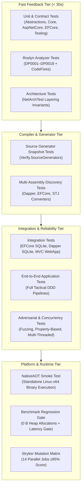

# Testing Strategy & Quality Roadmap

This document outlines the testing architecture, test project topology, and validation methodologies employed across the `EricksonLopez.DomainPrimitives` ecosystem.

---

## Testing Topology

The test architecture is structured across multiple defense-in-depth validation layers, from fast unit tests to full NativeAOT binary execution and mutation testing.



---

## Test Project Inventory (19 Suites in `tests/`)

| Test Project | Target Frameworks | Focus Area | Key Technologies |
|:---|:---:|:---|:---|
| `Abstractions.UnitTests` | `net8.0; net9.0; net10.0` | Invariant contracts, `PrimitiveError`, attribute behavior | xUnit, AwesomeAssertions |
| `UnitTests` | `net8.0; net9.0; net10.0` | Core scalar primitives, factory methods, BCL parsers, date/numeric logic | xUnit, AutoFixture, Bogus |
| `SourceGenerators.Tests` | `net10.0` | Compile-time generator emission for IDs, strings, numerics, and value objects | Verify.SourceGenerators, Roslyn TestKit |
| `Analyzers.Tests` | `net10.0` | DP0001–DP0018 diagnostics and automated code fix providers | Roslyn Analyzer Testing |
| `AspNetCore.UnitTests` | `net8.0; net9.0; net10.0` | Model binders, route constraints, DataAnnotations validator | Microsoft.AspNetCore.Mvc.Testing |
| `AspNetCore.SourceGenerators.Tests` | `net10.0` | Minimal API model binder generator output | Verify.SourceGenerators |
| `EFCore.UnitTests` | `net8.0; net9.0; net10.0` | `ValueConverter` mappings and convention discovery | EF Core InMemory |
| `EFCore.SourceGenerators.Tests` | `net10.0` | EF Core convention generator snapshots | Verify.SourceGenerators |
| `EFCore.IntegrationTests` | `net8.0; net9.0; net10.0` | Real database querying, migrations, SQLite provider | EF Core SQLite |
| `Dapper.IntegrationTests` | `net8.0; net9.0; net10.0` | Dapper query parameters, scalar reads, multi-mapping | Dapper, Microsoft.Data.Sqlite |
| `Dapper.SourceGenerators.Tests` | `net10.0` | TypeHandler and JSON converter generator snapshots | Verify.SourceGenerators |
| `OpenApi.Tests` | `net8.0; net9.0; net10.0` | Swagger schema filter generation and schema assertions | Swashbuckle, Microsoft.OpenApi |
| `OpenApi.SourceGenerators.Tests` | `net10.0` | OpenAPI schema filter generator snapshots | Verify.SourceGenerators |
| `NewtonsoftJson.Tests` | `net8.0; net9.0; net10.0` | Json.NET serialization, deserialization, contract resolvers | Newtonsoft.Json |
| `Testing.UnitTests` | `net8.0; net9.0; net10.0` | Test assertion helpers, fake factories, scenario builders | Bogus, AwesomeAssertions |
| `ArchitectureTests` | `net8.0; net9.0; net10.0` | Dependency layering, immutable struct rules, no leaky abstractions | NetArchTest.Rules |
| `IntegrationTests` | `net8.0; net9.0; net10.0` | Cross-package integration (MVC -> Domain -> EF Core) | Microsoft.AspNetCore.Mvc.Testing |
| `EndToEndTests` | `net8.0; net9.0; net10.0` | Full CQRS pipeline with transactional persistence and events | SQLite, MediatR simulation |
| `AotSmokeTest` | `net10.0` | NativeAOT compilation and runtime execution gate (`PublishAot=true`) | Native ILC Toolchain |

---

## Specialized Testing Methodologies

### 1. Property-Based Testing (FsCheck)
`PropertyBasedContractTests.cs` utilizes FsCheck to generate thousands of random inputs per run, verifying algebraic laws:
- **Round-trip Invariance:** $\forall x \in ValidDomain : \text{Parse}(\text{ToString}(x)) = x$.
- **Normalization Idempotence:** $\forall s : \text{Create}(\text{Normalize}(s)) = \text{Create}(s)$.
- **Span/String Parity:** `TryParse(string)` and `TryParse(ReadOnlySpan<char>)` yield identical outcomes for any string input.

### 2. Concurrency & Fuzzing Stress Testing
`ConcurrencyAndFuzzingTests.cs` subjects primitives to multi-threaded race condition tests (50+ concurrent tasks calling factory methods simultaneously) and adversarial string payloads (null bytes, homoglyphs, surrogate pairs, overlong UTF-8 encodings).

### 3. NativeAOT Smoke Testing
`tests/EricksonLopez.DomainPrimitives.AotSmokeTest` is an independent console application designed to be compiled with `PublishAot=true`. It exercises:
- Scalar primitive creation and validation.
- JSON serialization/deserialization via generated converters.
- Span-based UTF-8 parsing.
If any component relies on unannotated runtime reflection, the .NET ILC compiler emits `IL2026` or `IL3050` warnings, which are treated as fatal compilation errors (`TreatWarningsAsErrors=true`).

### 4. Mutation Testing (Stryker.NET)
Mutation testing injects artificial syntax mutations into production code (e.g., swapping `<=` to `<`, replacing boolean logic, removing statements) and asserts that existing test suites fail.
- **Break Threshold:** 95% (any mutation score below 95% fails CI).
- **High Threshold:** 100%.
- **Execution Matrix:** 14 parallel jobs run via `.github/workflows/mutation-testing.yml`.

---

## Local Execution Guide

### Run All Tests
```bash
dotnet test EricksonLopez.DomainPrimitives.slnx --configuration Release
```

### Run With Code Coverage
```bash
dotnet test EricksonLopez.DomainPrimitives.slnx --configuration Release --collect:"XPlat Code Coverage"
```

### Run Specific Test Categories
```bash
# Security & Adversarial tests
dotnet test --filter "Category=Security"

# Architecture & Layering rules
dotnet test --filter "Category=Architecture"

# API Surface Budget verification
dotnet test --filter "Category=ApiSurfaceBudget"
```

### Run NativeAOT Smoke Test Locally (Linux or WSL2)
```bash
dotnet publish tests/EricksonLopez.DomainPrimitives.AotSmokeTest \
  -c Release -r linux-x64 --self-contained -p:PublishAot=true
./tests/EricksonLopez.DomainPrimitives.AotSmokeTest/bin/Release/net10.0/linux-x64/publish/EricksonLopez.DomainPrimitives.AotSmokeTest
```
