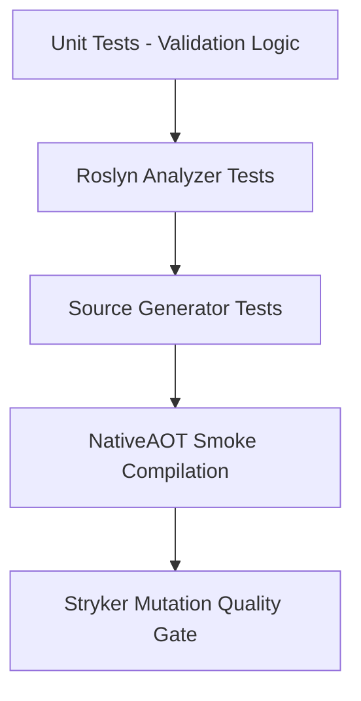

# Testing Strategy & Quality Roadmap

---

## 1. Testing Topology

- **Unit Tests**: Validates boundary validation cases, error codes, and formatting.
- **Analyzer Tests**: Validates compilation warnings and code fix providers.
- **Generator Tests**: Validates emitted source code syntax and semantics.
- **AOT Smoke Tests**: Verifies standalone native binary execution with `PublishAot=true`.
